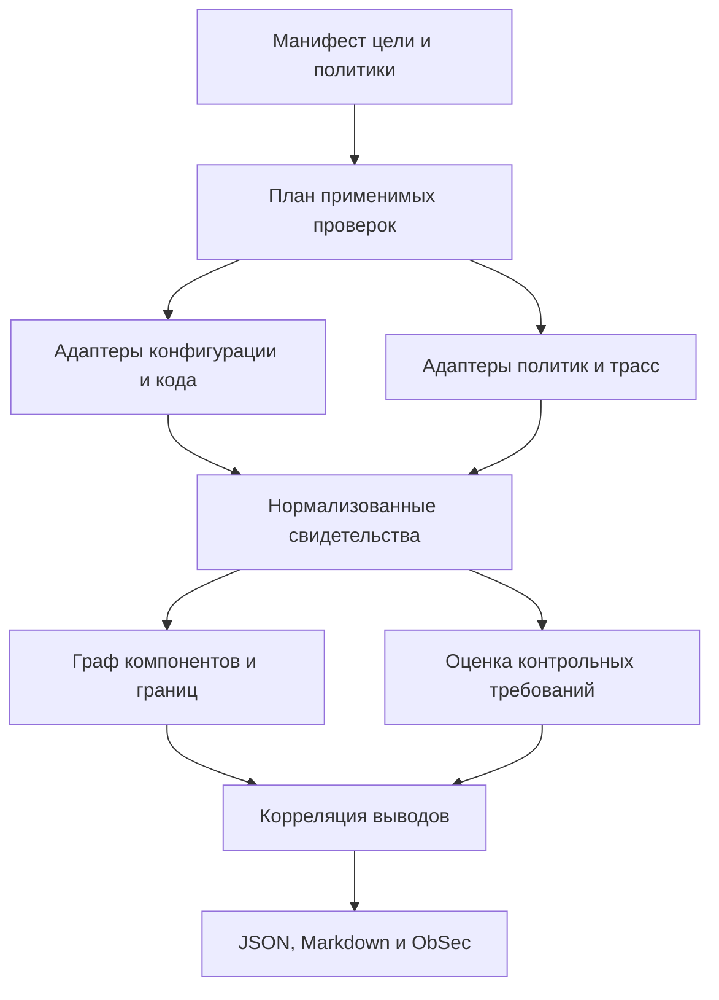

# Изменения архитектуры аудита агентных систем

**Назначение:** техническое задание на переработку `docs/audit_subsystem_architecture.md` и связанных компонентов аудитора.
**Проект:** Agentic Red Teaming; интеграция с внутренней ObSec-платформой, без отдельного веб-интерфейса.
**Дата подготовки:** 5 сентября 2026 года.
**Проверенная база:** репозиторий `userIlyas/aith_redteaming`, указанный пользователем коммит `912edfb1a3891f07a6986b15ca8b6f9188800709` ветки `bulochka68-with-stand`.
**Статус документа:** предлагаемая спецификация v2.0. Описанные новые поля, правила и модули ещё не реализованы этим документом.

Исходный Markdown, пример отчёта и перечисленные ниже участки кода прочитаны через GitHub. Анализ статический: стенд, MCP-процессы и проверки поведения модели не запускались. Выводы относятся к указанному коммиту; актуальность для других сборок требует отдельной сверки.

Основной документ — [docs/audit_subsystem_architecture.md](https://github.com/userIlyas/aith_redteaming/blob/912edfb1a3891f07a6986b15ca8b6f9188800709/docs/audit_subsystem_architecture.md). В репозитории есть его идентичная на этом коммите копия в `aith_redteaming/docs/`, а часть кода в корне и вложенном каталоге уже различается. В рамках миграции следует выбрать один канонический пакет и заменить дублирующую документацию ссылкой на него.

## 1. Главный результат переработки

Аудит должен отвечать на пять вопросов:

1. Какие компоненты, данные, инструменты и фоновые операции доступны системе?
2. Кто имеет право читать, изменять и публиковать эти данные?
3. Где недоверенное содержимое может получить дополнительные полномочия, включая переход в общую память или политику?
4. Какая часть каждого вывода подтверждена конфигурацией, кодом, политикой доступа или наблюдением выполнения?
5. Какие границы проверены, какие не проверены и какие доработки закроют обнаруженный разрыв?

Для этого требуется расширить объект аудита с MCP-инструментов до жизненного цикла агентной системы. MCP остаётся одним из поддерживаемых интерфейсов. Память, API, фоновые обработчики, встроенные функции, хранилища и межсервисная авторизация должны учитываться независимо от наличия MCP.

**Косметической правки Markdown недостаточно.** Новые утверждения в документе должны сопровождаться изменениями схемы, сборщиков, правил, формирования вердикта и отчётности. Иначе документация будет обещать проверки, которых движок не выполняет.

## 2. Что уже подтверждено и что нужно исправить в трактовке

| Наблюдение на выбранном коммите | Что это означает для нового аудита |
|---|---|
| Документ описывает `audit v1.0`, пример JSON содержит `version: 1.1` | Разделить версии схемы отчёта, движка, правил и документации; описать миграцию |
| В примере `mode=passive`, `tests=[]`, источники инвентаря — `config` | Отчёт не содержит выполненных проверок поведения |
| `verdict.basis="effective+verified"` задан константой; в пассивном режиме `confidence=0.6` | Основание и уверенность не отражают доказательства конкретного вывода |
| В примере 9 инструментов `mcp-invest` и 1 встроенный поиск; в серверном исходнике 14 MCP-деклараций | Есть расхождение статических каталогов; фактическое количество на работающем сервере не проверено |
| Поиск в конфигурации принимает `query: string`, в функции — `queries: List[str]` | Проверка по устаревшей схеме может завершиться ошибкой аргументов, не достигнув проверяемого контроля |
| Оркестратор преобразует извлечённый факт со `scope=global` в `AgentPolicyMemory` | Решение LLM о широте применимости связано с публикацией общей политики |
| Общая политика читается без привязки к текущему пользователю и входит в системное сообщение | Код содержит путь повышения доверия к содержимому; успешное прохождение конкретного текста и эффект на модель не установлены |
| В рабочую память пишутся запрос и финальный ответ, а не сырые результаты инструментов | Для связи tool result → memory нужна прослеживаемость производного ответа и последующей обработки |
| Клиентский режим влияет на проверки принадлежности ресурса; проверка памяти устроена отдельно | Нужно проверять независимые границы: режим сервера, авторизацию каждого перехода и права записи памяти |

Основания: [пример аудита](https://github.com/userIlyas/aith_redteaming/blob/912edfb1a3891f07a6986b15ca8b6f9188800709/examples/genai_invest_stand.audit.json), [генератор вердикта](https://github.com/userIlyas/aith_redteaming/blob/912edfb1a3891f07a6986b15ca8b6f9188800709/mcp_audit/correlation/verdict.py), [MCP-сервер](https://github.com/userIlyas/aith_redteaming/blob/912edfb1a3891f07a6986b15ca8b6f9188800709/mcp-invest/server.py), [встроенный поиск](https://github.com/userIlyas/aith_redteaming/blob/912edfb1a3891f07a6986b15ca8b6f9188800709/app/agent/tools.py), [оркестратор памяти](https://github.com/userIlyas/aith_redteaming/blob/912edfb1a3891f07a6986b15ca8b6f9188800709/app/orchestrator/graph.py), [сборка контекста](https://github.com/userIlyas/aith_redteaming/blob/912edfb1a3891f07a6986b15ca8b6f9188800709/app/memory/store.py), [исполнение агента](https://github.com/userIlyas/aith_redteaming/blob/912edfb1a3891f07a6986b15ca8b6f9188800709/app/agent/runner.py).

Дополнительные проблемы достоверности обнаружены уже в самом аудиторе:

| Текущее поведение | Требуемое изменение |
|---|---|
| `effective_access.py` добавляет `_ALWAYS_DENY` к предполагаемым запрещённым путям | Выдавать это как ожидаемую политику. Реально действующий запрет требует отдельного основания |
| Права БД и сетевые возможности выводятся из типа сервера, аргументов и overrides | Помечать вывод как предположение; получать политики БД, процесса и сети отдельными адаптерами |
| Любой `MCPError` или `isError` может стать `BLOCKED` | Различать отказ авторизации, ошибку схемы, неизвестный инструмент, транспортную ошибку и тайм-аут |
| Неожиданный результат boundary-проверки может стать `BOUNDARY_VIOLATION` даже при ошибке выполнения | Ошибка выполнения даёт неполный результат, а нарушение требует наблюдаемого запрещённого эффекта |
| Признак `verified` хранится у инструмента целиком | Подтверждение привязывать к конкретному утверждению, операции, субъекту, ресурсу и конфигурации |
| Наличие любого WRITE/DELETE участвует в `full_project_access` | Запись одного разрешённого объекта не доказывает полный доступ к проекту |
| Любое изменение определения называется `RUG_PULL` | Фиксировать дрейф и состояние согласования; злонамеренность и влияние требуют дополнительных оснований |
| `IsolationGuard` проверяет флаг и переменную окружения | Это подтверждение намерения, а не доказательство изоляции ОС, сети или удалённого сервера |
| Stdio discovery запускает процесс с наследованием окружения аудитора | Отделить offline-разбор от исполнения; использовать ограниченное окружение и техническую изоляцию |

Основания: [effective_access.py](https://github.com/userIlyas/aith_redteaming/blob/912edfb1a3891f07a6986b15ca8b6f9188800709/mcp_audit/classification/effective_access.py), [active/runner.py](https://github.com/userIlyas/aith_redteaming/blob/912edfb1a3891f07a6986b15ca8b6f9188800709/mcp_audit/active/runner.py), [active/isolation.py](https://github.com/userIlyas/aith_redteaming/blob/912edfb1a3891f07a6986b15ca8b6f9188800709/mcp_audit/active/isolation.py), [baseline.py](https://github.com/userIlyas/aith_redteaming/blob/912edfb1a3891f07a6986b15ca8b6f9188800709/mcp_audit/reporting/baseline.py), [introspector.py](https://github.com/userIlyas/aith_redteaming/blob/912edfb1a3891f07a6986b15ca8b6f9188800709/mcp_audit/discovery/introspector.py).

## 3. Карта изменений исходного Markdown

| Место в текущем файле | Действие | Новое содержание и критерий готовности |
|---|---|---|
| Заголовок и вводные | Заменить | «Архитектура аудита безопасности агентных систем»; входы включают память, идентичности, политики и трассы; формат v2.0 явно обозначен как целевой |
| §0 «Что аудит должен производить» | Переписать | Пять вопросов из §1 этого ТЗ; обязательны покрытие, ограничения и доказательства каждого finding |
| §1.1 «Три плоскости» | Расширить | Инвентарь и возможности; определения и контекст; идентичность и авторизация; память; наблюдаемое поведение; инфраструктура |
| §1.2 «Три уровня доверия» | Заменить целиком | Независимые поля происхождения, способа проверки, статуса утверждения и полноты наблюдения |
| §2 «Компонентная архитектура» | Перестроить | Переносимое ядро, адаптеры источников, граф границ доверия, каталог правил, хранилище свидетельств, экспорт в ObSec |
| §3, слой 1 Discovery | Дополнить | Сверка config/source/live/runtime, встроенные инструменты и фоновые операции, неизученные компоненты |
| §3, слой 2 Static Analysis | Дополнить | Отдельные оценки определений, результатов и производного контента; эвристика текста не подтверждает компрометацию |
| §3, слой 3 Classification | Заменить модель | Множество операций и эффектов, субъект выполнения, область доступа, основание каждого свойства |
| §3, слой 4 Active Verification | Переписать | Контрольные проверки в изолированных фикстурах, точная семантика исходов, наблюдение эффектов, завершение фоновых задач |
| §3, новый слой Memory Lifecycle | Добавить | Права записи, выбор области, публикация, извлечение, сборка контекста, использование, отзыв и удаление |
| §3, новый слой Identity & Authorization | Добавить | Входная личность, делегирование, ресурсная принадлежность, серверная политика, сервисные полномочия |
| §3, слой 5 Correlation | Переписать | Связность фактов и границ вместо объединения трёх флагов; раздельные статические и наблюдаемые выводы |
| §3, слой 6 Reporting | Расширить | Канонический JSON, Markdown из того же JSON, устойчивые идентификаторы, доказательства, ограничения, история исправлений |
| §4 «Поток данных» | Заменить | Сначала план применимости и сбор свидетельств; затем оценка правил, корреляция и отчёт |
| §5 «Режимы» | Заменить | Offline, live inventory, trace review, controlled validation; drift — операция сравнения, а не особый уровень доверия |
| §6 «Границы доверия» | Переписать | Недоверенны также результаты, логи и вывод модели; доверие к сборщику не делает содержание истинным |
| §7 «Привязка к JSON» | Заменить | Версионированные контракты из §15–16 этого ТЗ; схема уже имеет definition analysis в v1.1, её не нужно «добавлять впервые» |
| §8 «Связь с пайплайном» | Уточнить | P2 получает факты и неопределённости; последующие этапы получают ссылки на проверяемые контроли и предпосылки, без автоматического повышения статуса |
| После §8 | Добавить | Профили и адаптеры, каталог правил, метрики, миграцию, план по файлам, критерии приёмки и приложение стенда |

Все существующие ASCII-схемы заменить компактными Mermaid-диаграммами или таблицами. Удалить безусловные формулировки «пассивный режим безопасен где угодно», «результаты проб доверенны» и «изменение хэша доказывает rug pull».

## 4. Термины, которые нужно развести

| Термин | Определение |
|---|---|
| Область видимости | Кто может получить запись: сессия, пользователь, группа, проект, агент, организация либо явно установленная общая аудитория |
| Полномочие записи | Кто вправе создавать, изменять или публиковать запись в этой области |
| Авторитет содержимого | Может ли запись задавать правила поведения либо представляет справочные данные |
| Достоверность факта | Насколько обосновано содержание записи; это не право распоряжаться агентом |
| Происхождение | Откуда взяты данные и какие преобразования они прошли |
| Возможность | Какие действия доступны компоненту технически |
| Уязвимость | Нарушение конкретного требования безопасности при установленных предпосылках |
| Наблюдение | Зафиксированное событие, состояние или исход, ограниченный конкретной средой |
| Finding | Структурированный вывод с нарушенным требованием, основаниями, статусом и рекомендацией |

`scope=global` сам по себе не является уязвимостью. Общие справочники и опубликованные доверенным процессом правила допустимы. Проблема возникает, когда недоверенный источник сам определяет аудиторию или получает полномочие публикации.

Параметры `scope`, `tenant_id`, `user_id` и `agent_id` — часть модели приложения. Их наличие в документе MongoDB, ключе Redis или метаданных векторной базы не доказывает исполнение контроля доступа.

Области не следует считать одной линейной шкалой: проект может включать нескольких пользователей; агент может обслуживать несколько организаций. Нужна явная политика отношений и разрешённого совместного доступа.

## 5. Переносимая архитектура и контракт цели



Контролируемые проверки на фикстурах — дополнительный источник свидетельств для того же ядра. Ядро оценивает заранее определённые требования; оно не должно самостоятельно придумывать новые цели доступа или расширять область проверки по тексту внешнего источника.

### 5.1 Обязательные входные сведения

| Блок | Что хранить |
|---|---|
| Идентичность цели | Логический target ID, сборка/commit, среда, время снимка, границы системы |
| Компоненты | Агент, оркестраторы, MCP/REST-сервисы, встроенные функции, очереди, память, кэши, внешние провайдеры |
| Политика доступа | Ожидаемые отношения субъект → операция → ресурс → условия; версия и владелец политики |
| Политика памяти | Разрешённые области и обмен, доверенный издатель общих правил, ограничения хранения и отзыва |
| Наблюдаемость | Какие конфиги, исходники, ACL, события памяти и трассы доступны; какие отсутствуют |
| Адаптеры | Тип, версия, поддерживаемые операции чтения и нормализации, ограничения |
| Профиль проверки | Black box / grey box / white box как описание доступных источников, отдельно от режима выполнения |
| Воспроизводимость | Версии модели, промптов, retrieval и схем; параметры генерации, если доступны |
| Контрольные фикстуры | Ссылки на изолированные синтетические данные и ожидаемые политики |

Секреты в манифест не включать: только ссылки на разрешённые привязки учётных данных. Если политика совместного доступа не определена, аудитор может показать поток данных, но не должен угадывать, является ли он нарушением.

### 5.2 Иллюстрация конфигурации v2

Ниже — предлагаемый формат, не команда и не конфигурация, которую уже понимает текущий CLI.

```yaml
schema_version: "2.0"
target:
  id: "agent-fixture"
  build_ref: "fixture-build-1"
  environment: "isolated-fixture"
inspection:
  access_profile: "grey_box"
  mode: "offline"
  business_policy_ref: "policy-fixture-v1"
  inventory_manifest_ref: "inventory-fixture-v1"
adapters:
  - id: "application-source"
    kind: "source_snapshot"
    binding_ref: "source-snapshot-binding"
  - id: "memory-events"
    kind: "memory_event_snapshot"
    binding_ref: "memory-evidence-binding"
required_controls:
  - "MEM-01"
  - "MEM-02"
  - "AUTH-01"
  - "AUTH-02"
reporting:
  formats: ["json", "markdown"]
  evidence_policy_ref: "redacted-evidence-v1"
```

Отсутствующий обязательный адаптер должен давать `not_evaluated` для зависимых требований и неполную оценку. Он не должен превращаться в пустой список находок с зелёным вердиктом.

### 5.3 Интерфейсы адаптеров

| Адаптер | Возвращает ядру | Что не должен предполагать |
|---|---|---|
| MCP inventory | Идентичность сервера, версию протокола, definitions, resources/prompts, источник и время снимка | Что отсутствие инструмента в одном ответе доказывает его отсутствие при другой роли |
| REST/OpenAPI inventory | Операции, схемы, declared security и привязки ресурсов | Что описание security доказывает исполнение авторизации |
| Native function / source | Встроенные функции, фоновые задачи, места доступа к данным и происхождение вывода | Что имя функции точно определяет её побочные эффекты |
| Memory | Типы записей, области, происхождение, события изменения и выборки | Что Redis, MongoDB или векторная БД автоматически изолируют пользователей |
| Identity / policy | Снимок разрешений, делегирование, правила ресурса и конфигурацию проверки токенов | Что наличие валидного токена даёт право на любой объект |
| Trace | События, субъект, компонент, причинные связи, версии и качество наблюдения | Что текст ответа сервиса достоверен без независимого подтверждения |
| Deployment | Снимки сетевых правил, сервисных прав и конфигурации хранилищ | Что опубликованный порт доступен из интернета |

В каждом адаптере обязательны `adapter_version`, перечень поддерживаемых возможностей и явные причины `unsupported`. Неизвестные поля источника сохраняются как расширения с пространством имён, а не теряются молча.

Критерий переносимости: подключение второго семейства хранилищ или системы без MCP меняет адаптер и профиль, но не семантику базовых правил изоляции и не структуру finding.

## 6. Полный инвентарь и контроль его свежести

Для каждого компонента отдельно учитывать:

- `configured`: что указано в конфиге;
- `source_defined`: что объявлено в конкретной сборке;
- `live_advertised`: что предъявлено при handshake под конкретной идентичностью;
- `runtime_observed`: что фактически участвовало в записанных событиях;
- `policy_authorized`: что разрешено доверенной политикой.

Источники могут расходиться законно: feature flags, роли, деплой другой версии, ленивое подключение, недоступность сборщика. Поэтому расхождение требует причины и не должно автоматически трактоваться как скрытый инструмент.

Обязательные изменения:

1. Сопоставлять ID сервера, сборку, роль, время и область снимка до сравнения списков.
2. Сравнивать имена, входные и выходные схемы, описания, annotations и server instructions.
3. Сохранять уже существующую пагинацию discovery; дополнить контролем полноты страниц, частичных ошибок и изменения каталога во время обхода.
4. Добавить встроенные инструменты, обработчики завершения сессий, периодические задачи, делегирование агентам и фоновые записи.
5. Учитывать реально доступные resources, prompts и иные используемые возможности протокола; не объявлять их покрытыми по наличию флага.
6. Хранить исходное определение и нормализованное представление раздельно. Unicode-анализ не должен уничтожать исходные байты доказательства.
7. Делать отказ discovery видимым: `unavailable`, `partial`, `stale`; не подменять его успешным handshake из config.
8. При несовпадении схем не использовать результат некорректного вызова как доказательство безопасности.

На стенде 9/14 = 64,3% означает только долю совпадающих имён инструментов MCP в конфигурационном примере относительно изученного серверного исходника. Это не процент проверенной безопасности и не измерение работающего deployment. Встроенный поиск учитывается отдельным компонентом.

## 7. Возможности и побочные эффекты

Заменить единственную классификацию READ/WRITE/EXEC/DELETE на несколько независимых свойств:

| Свойство | Примеры значений |
|---|---|
| Прямые операции | READ, CREATE, UPDATE, DELETE, EXECUTE, PUBLISH, TRANSMIT |
| Побочные эффекты | Запись диалога, обновление профиля, публикация политики, запись кэша, передача внешнему сервису |
| Исполняющий субъект | Пользователь, сервисная учётная запись, издатель политики, фоновый обработчик |
| Фаза | Обработка запроса, финализация, асинхронная задача, обслуживание памяти |
| Объект и область | Портфель, документ, сессия, проект, организация, общий справочник |
| Основание свойства | Definition, source inference, policy snapshot, runtime observation |
| Состояние знания | Известно, предполагается, неизвестно, имеются противоречия |

Чтение через инструмент может сопровождаться записью финального ответа в память. Это разные эффекты разных компонентов, которые нужно связать причинной ссылкой. Не следует менять класс инструмента на WRITE только потому, что после его работы оркестратор сохраняет диалог.

Наличие предусмотренного бизнес-процессом WRITE, EXECUTE или внешнего запроса — характеристика возможности. Finding появляется при нарушении требования доступа, доверия, изоляции или контроля эффекта. Широкие возможности могут повышать потенциальный ущерб, но не заменяют описание нарушенной границы.

## 8. Память как самостоятельный объект аудита

### 8.1 Карта жизненного цикла

Аудитор должен описывать каждый переход, даже если его выполняет фоновый обработчик без инструментального вызова.

| Этап | Что выяснять | Минимальное свидетельство |
|---|---|---|
| Получение данных | Источник, владелец, доверие, допустимое использование | Ссылка на входное событие и идентичность |
| Производный ответ / суммаризация | Какие источники участвовали и что преобразовано | Родительские события, версия преобразования |
| Извлечение кандидата | Кто предложил факт, тип, область и достоверность | Событие создания кандидата |
| Авторизация записи | Кто принял решение о владельце и аудитории | Решение приложения/политики, исполняющий субъект |
| Публикация | Как кандидат стал доступной памятью или правилом | Авторизованный переход состояния и версия |
| Хранение | Какие права имеют сервисы и кто может менять метаданные | Снимок ACL и модель доступа приложения |
| Извлечение | Как отбираются записи для конкретного контекста | Memory IDs, фильтры, пользователь, версия индекса |
| Сборка контекста | Что реально включено, с какой ролью и почему исключено | Ссылки на включённые записи, порядок, лимит, причины отсечения |
| Использование | Какое наблюдаемое действие связано с контекстом | Связанные события решения, ответа и вызовов |
| Отзыв / удаление | Как обновление достигает производных записей, кэшей и индексов | Версия отзыва и подтверждения обработки |

Запись в БД, результат retrieval и фрагмент, включённый в запрос модели, — разные наблюдения. Для стенда это особенно важно: память обрезается до 3000 символов при формировании системного сообщения.

### 8.2 Обязательные правила памяти

| ID | Проверяемое требование | Критерий результата | Основное основание |
|---|---|---|---|
| MEM-01 | Изоляция согласно бизнес-политике | Личные записи доступны только разрешённой аудитории; разрешённое совместное использование продолжает работать | ACL приложения/БД, события чтения, контрольные фикстуры |
| MEM-02 | Разделение записи пользовательских данных и публикации общей политики | Сервис обработки пользовательской сессии не может публиковать общие правила; издатель имеет отдельное полномочие | Поток кода, сервисные права, журнал публикации |
| MEM-03 | Сервер определяет владельца и разрешённую область | Метаданные от LLM или внешнего содержимого не устанавливают полномочия записи | Решение политики перед сохранением |
| MEM-04 | Разделение данных и инструкций | Справочные записи не получают права менять общие правила из-за роли сообщения или пересказа | Сборка контекста, authority каждого блока |
| MEM-05 | Сохранение происхождения при преобразовании | Производная запись связана со всеми известными родителями; потеря связи видима | Граф происхождения и события преобразований |
| MEM-06 | Отсутствие автоматического повышения доверия | Пересказ ассистентом и высокая LLM-confidence не являются разрешением публикации | Политика переходов и код |
| MEM-07 | Изоляция retrieval, кэша и индекса | Политика аудитории применяется до выдачи контекста; кэш не смешивает неразрешённые области | Правила фильтрации, ключи/разделы кэша, read-события |
| MEM-08 | Отзыв производных данных | После отзыва источник и зависящие от него неприемлемые записи не возвращаются в контекст за пределами заданного срока | События отзыва, версии индексов, контрольные фикстуры |
| MEM-09 | Корректность фоновых операций | Повторы, конкурирующие сессии и отложенные задачи сохраняют исходную идентичность и не публикуют отменённые данные | Job IDs, parent IDs, idempotency и policy revision |
| MEM-10 | Управляемое хранение | TTL, ограничение объёма, обновление и очистка определены по типам памяти; старые записи не восстанавливаются неуправляемо | Политика хранения, конфигурация, события обслуживания |

MEM-01 применяется к тем границам, которые предусмотрены системой: пользователям, организациям, агентам, сессиям, проектам или группам. Нельзя объявлять отсутствие изоляции между двумя агентами нарушением, если их совместная память явно разрешена.

Для систем с векторной памятью добавить профиль проверки фильтров доступа, разделения индекса, метаданных документа, retrieval/reranking и повторной индексации. Само наличие похожести или `top_k` не даёт сведений о правах.

### 8.3 Нормализованная запись памяти

Адаптер должен представлять следующие свойства, даже если в исходном хранилище они разнесены по коллекциям и журналам:

| Группа | Поля |
|---|---|
| Идентификаторы | `memory_id`, `version`, `memory_type`, `store_ref` |
| Владение | `tenant_ref`, `subject_ref`, применимые `agent_ref` и `session_ref` |
| Доступ | `read_audience_ref`, `write_policy_ref`, `authority` |
| Авторство | `origin_actor_ref`, `writer_principal_ref`, `publisher_ref` |
| Происхождение | `source_event_refs`, `derived_from`, `transformation_ref`, `lineage_completeness` |
| Согласование | `review_state`, `approval_ref`, `policy_revision` |
| Жизненный цикл | `created_at`, `expires_at`, `revoked_at`, `supersedes_ref` |
| Содержимое | Ограниченное представление или защищённая ссылка; digest там, где это допустимо |

Неизвестные значения сохраняются как неизвестные. Если у исходной записи нет владельца, адаптер не должен подставлять текущего пользователя и тем самым скрывать дефект.

Метаданные полномочий устанавливает доверенная сторона. Содержимое записи не может само удостоверить собственный источник, подпись, владельца или проверенность. Поле `trusted=true`, полученное от LLM, доказательством не является.

При объединении нескольких источников сохраняются все известные ограничения аудитории. Расширение аудитории или публикация политики требуют отдельного разрешённого процесса. Достоверность содержания и право его публикации оцениваются раздельно.

## 9. Идентичность, ресурсная авторизация и инфраструктура

| ID | Проверяемое требование | Критерий результата |
|---|---|---|
| AUTH-01 | Доверенная входная идентичность | Пользователь устанавливается аутентификацией; произвольные поля тела и содержимое диалога её не заменяют |
| AUTH-02 | Авторизация субъекта на конкретный ресурс | На каждом сервисном переходе проверяется разрешение на объект, включая отношения клиент → счёт → операция |
| AUTH-03 | Серверная политика безопасности | Параметры клиента не ослабляют обязательные проверки защищённого deployment |
| AUTH-04 | Проверка назначения и происхождения токена | Каждый принимающий сервис проверяет подходящие для своей схемы issuer, audience, подпись, время и требования к алгоритму |
| AUTH-05 | Ограниченное делегирование | Передаваемые полномочия соответствуют задаче и ресурсу; сервисная учётная запись не обходит ограничения конечного пользователя |
| AUTH-06 | Применение изменений полномочий | Смена роли, отзыв и окончание срока не оставляют действующий доступ через кэш или фоновую задачу сверх заданной политики |
| INFRA-01 | Ограниченный доступ к памяти | Доступ к хранилищу имеют нужные сервисы с минимальными правами; публикация общей политики выделена отдельно |
| INFRA-02 | Наблюдаемая сетевая граница | Отдельно описаны bind, публикация порта, маршрутизация и фильтрация; доступность подтверждается для конкретной зоны |
| INFRA-03 | Изоляция проверочного окружения | Проверки используют изолированные данные и ограниченные полномочия; флаг в конфиге не считается обеспечением изоляции |

Для каждого перехода сохранять отдельную запись: входная идентичность → исполняющий сервис → операция → ресурс → решение политики → следующий принимающий сервис. Успешный отказ на входном API не подтверждает качество авторизации бэкенда, до которого запрос не дошёл.

В случае JWT нельзя ограничиваться проверкой подписи. Требования валидации issuer и audience описаны в [RFC 8725, §3.8–3.9](https://www.rfc-editor.org/rfc/rfc8725.html). Конкретные ожидаемые значения задаёт доверенная конфигурация соответствующего сервиса.

Для MCP при применимости его OAuth-профиля учитывать привязку токена к получателю и разграничение токенов соседних сервисов. Основание — [MCP Authorization Security Considerations, редакция 2026-07-28](https://modelcontextprotocol.io/specification/2026-07-28/basic/authorization/security-considerations). Это справочная привязка требований, а не утверждение о версии протокола, реализованной изученным стендом.

Для API-ключей, сессионной аутентификации и иной схемы использовать соответствующий профиль контроля; отсутствие JWT не означает провал AUTH-04. Правило может быть неприменимо с обоснованием, а эквивалентные требования к схеме аутентификации — обязательными.

## 10. Определения, результаты инструментов и исходящие данные

### 10.1 Разделить источники риска

| Поверхность | Откуда возникает возможность влияния | Что подтверждает аудит |
|---|---|---|
| Definition: описание, схема, annotations, server instructions | Управление поставкой, сервером или конфигурацией | Содержание и изменения определения; наличие полномочия на изменение проверяется отдельно |
| Tool result: документы, поисковые ответы, данные, ошибки | Управление источником возвращаемого содержимого | Получение недоверенных данных и условия их обработки |
| Производный ответ ассистента | Преобразование известных источников моделью | Связь ответа с источниками — в пределах доступной трассировки |
| Производная память | Сохранение ответа или его суммаризации | Переходы записи, области, публикации, retrieval и контекста |

Наличие подозрительного описания не доказывает, что обычный пользователь может менять сервер. Получение недоверенного результата не доказывает, что он был сохранён. Пересказ результата не делает его доверенным.

### 10.2 Правила

| ID | Проверяемое требование | Критерий результата |
|---|---|---|
| TOOL-01 | Контроль одобренных определений | Определение связано с идентичностью сервера и согласованной версией; изменение даёт статус дрейфа |
| TOOL-02 | Корректный контракт операции | Входная/выходная схемы, обработка ошибок и реально наблюдаемая версия согласованы |
| TOOL-03 | Однозначное разрешение имён | Namespace и выбор инструмента различают серверы; совпадение имён оценивается с учётом реального маршрутизатора |
| TOOL-04 | Результат инструмента остаётся данными | Содержимое результата не управляет политикой доступа и издателем общей памяти |
| TOOL-05 | Обоснованность текстовых сигналов | Linter сохраняет фрагмент, правило и объяснение; императив, Unicode или ссылка сами по себе не доказывают вредоносность |
| EGRESS-01 | Контроль передаваемых данных | Для внешнего получателя разрешены и адресат, и категория данных; поиск учитывается как передача текста |
| EGRESS-02 | Наблюдаемость внешних эффектов | Разделяются подготовленный запрос, разрешение шлюза и фактически полученные локальной фикстурой данные |

MCP annotations описывают поведение, но не обеспечивают его. Официальная спецификация отдельно предупреждает о доверии к описаниям и annotations: [MCP, Security and Trust & Safety](https://modelcontextprotocol.io/specification/2025-11-25).

Для EGRESS-01 недостаточно списка разрешённых доменов: разрешённый поисковый провайдер всё равно может получить данные, которые ему передавать нельзя. При оценке учитывать запросы, аргументы инструментов, телеметрию, журналы, внешние модели и разрешённые каналы экспорта в рамках заявленной границы системы.

## 11. Корреляция по связям и границам доверия

Сохранить `LETHAL_TRIFECTA` как индикатор сочетания возможностей. Перестать представлять его как доказательство утечки.

Новый коррелятор должен различать:

| Состояние | Требуемое основание |
|---|---|
| `capability_combination` | В инвентаре присутствуют чувствительные данные, недоверенные источники и внешний канал |
| `static_path_supported` | Код/конфигурация связывают эти компоненты при явно перечисленных условиях |
| `runtime_path_observed` | Конкретная трасса подтверждает соответствующие переходы |
| `control_violation_observed` | Установлен эффект, нарушающий конкретное правило доступа или обработки данных |
| `unknown` | Для оценки связности или результата недостаточно источников |

Граф содержит компоненты, источники данных, хранилища, субъектов, издателей политики и точки контроля. Каждое ребро имеет основание, условия, ожидаемую границу доступа, область и статус наблюдения.

Нельзя объединять возможности разных пользователей, deployment или несовместимых security-профилей в одну цепочку. Нельзя переносить runtime-подтверждение одного ребра на остальные.

Для памяти фиксировать, например, наличие связи между преобразованием диалога и публикацией политики как отдельный архитектурный дефект. Не требовать внешнего канала для finding о нарушении целостности общей памяти.

Точки обрыва также входят в результат: запрет публикации, авторизация ресурса, отбор памяти, отсечение контекста, запрет исходящих данных. Отсечение по длине ограничивает наблюдаемый путь в конкретном запуске, но не считается устойчивым контролем безопасности.

## 12. Доказательства и семантика результатов

### 12.1 Отказаться от единой шкалы declared → effective → verified

Для каждого утверждения хранить независимые характеристики:

| Характеристика | Значения или содержание |
|---|---|
| `source_type` | config, definition, source_code, policy_snapshot, runtime_trace, fixture_observation |
| `method` | parsing, static_analysis, policy_inspection, observation, controlled_validation |
| `claim_status` | hypothesis, static_supported, runtime_supported, contradicted, inconclusive |
| `evidence_refs` | Конкретные идентификаторы свидетельств |
| `scope` | Сборка, среда, субъект/роль, компонент, ресурс, конфигурация |
| `confidence` | low/medium/high с пояснением либо unknown; не вычисленная без калибровки вероятность |
| `limitations` | Неизученные условия, отсутствующие трассы, неполнота происхождения, несовпадение версий |

`static_supported` может быть достаточным основанием для finding о дефекте кода. Он не означает наблюдаемое влияние на работающую модель. `runtime_supported` подтверждает только явно сформулированное утверждение в установленной области.

Происхождение описывает, откуда взято свидетельство; уверенность — насколько оно поддерживает конкретное утверждение. Нельзя повышать доверие к исходному тексту только потому, что его записал доверенный сборщик.

### 12.2 Разделить выполнение и оценку контроля

У каждой проверки должны быть:

- `execution_status`: completed, error, timeout или skipped;
- `applicability`: applicable, not_applicable или unknown;
- `expected_invariant`: проверяемое требование;
- `observed_effect` и основания его интерпретации;
- `control_outcome`: PASS, FAIL, INCONCLUSIVE, NOT_EVALUATED или NOT_APPLICABLE;
- `evaluated_boundary_refs`: границы, до которых действительно дошло наблюдение.

| Условие | Наблюдение | Исход контроля |
|---|---|---|
| Разрешённая операция должна работать | Подтверждён разрешённый эффект | PASS |
| Запрещённый эффект должен отсутствовать | Подтверждён целевой отказ политики, отсутствует эффект | PASS |
| Запрещённый эффект должен отсутствовать | Эффект наблюдался | FAIL |
| Разрешённая операция должна работать | Подтверждён необоснованный политикой отказ | FAIL для функционального контрольного случая |
| Любое требование | Неверная схема, неизвестный метод, тайм-аут, недоступность сборщика | INCONCLUSIVE |
| Проверка применима, но не выполнялась | Нет наблюдения | NOT_EVALUATED |
| Возможность отсутствует и это установлено | Есть основание неприменимости | NOT_APPLICABLE |

«Blocked» — возможное наблюдение, а не универсальная оценка безопасности. Отказ из-за недействительного токена не подтверждает разграничение объектов для корректно аутентифицированного субъекта.

Текст «доступ запрещён» в ответе модели также недостаточен: приложение могло уже выполнить нежелательный эффект. И наоборот, строка «готово» не доказывает изменение состояния.

### 12.3 Отдельные наблюдения памяти

Для каждого рассматриваемого случая фиксировать:

| Стадия | Что подтверждается | Чего это ещё не доказывает |
|---|---|---|
| W — written | Запись существует в установленной области | Что её кто-либо извлёк |
| R — retrieved | Запись выбрана для определённого субъекта | Что она включена в запрос модели |
| C — context included | Запись реально вошла в контекст с известной ролью | Что изменились ответ или действие |
| B — behavior observed | Наблюдается заранее определённый эффект | Что он причинно обусловлен именно этой записью |

Для каждой стадии использовать `observed`, `not_observed`, `unknown` или `not_evaluated`. `not_observed` допустим только при достаточном охвате соответствующего события. Если трассы не содержат подбор памяти, отсутствие события retrieval означает unknown.

Причинность оценивать на изолированных синтетических фикстурах с одинаковой политикой и сопоставимыми параметрами, используя контрольное состояние и состояние с легитимно подготовленными тестовыми данными. Предварительно определить измеряемый эффект; учитывать стохастичность и ошибки наблюдения.

Прямая подготовка записи администратором фикстуры проверяет последующие стадии чтения и использования. Она не подтверждает, что пользовательская сессия способна создать такую запись. Это ограничение должно автоматически попадать в finding.

Результат LLM-судьи — вспомогательное свидетельство. Для прав доступа и изменений состояния предпочтительны проверки политики, событий и состояния фикстуры. Спорные выводы требуют разбора, а не автоматического повышения severity.

## 13. Покрытие, уверенность и серьёзность

### 13.1 Покрытие

Не выводить единый «процент безопасности». Отчёт должен показывать отдельные измерения:

| Метрика | Числитель и знаменатель | Ограничение |
|---|---|---|
| Полнота инвентаря | Сопоставленные объекты / объекты установленного эталонного списка | Эталон может быть частичным; тогда общая полнота неизвестна |
| Покрытие компонентов | Оценённые компоненты / компоненты манифеста | Не подтверждает глубину проверки каждого компонента |
| Покрытие обязательных контролей | PASS + FAIL / все обязательные контроли, кроме обоснованно неприменимых | INCONCLUSIVE, NOT_EVALUATED и неизвестная применимость остаются в знаменателе |
| Покрытие идентичностей | Оценённые отношения доступа / отношения ожидаемой политики | Не заменяется числом использованных токенов |
| Покрытие памяти | Отдельно W, R, C, B для применимых случаев | Стадии нельзя объединять в один verified |
| Покрытие границ | Оценённые переходы / переходы принятой модели | Недостигнутый бэкенд не считается проверенным |
| Качество выполнения | Валидно завершённые случаи, ошибки, тайм-ауты, пропуски | Ошибки нельзя исключить так, чтобы отчёт выглядел полным |
| Качество наблюдения | Наличие нужных полей, связь событий, потери и задержка журналов | Отсутствие события доказательно только при достаточной наблюдаемости |

Для каждой доли сохранять исходные количества, источник знаменателя, список пропусков и метод оценки. Статическое покрытие и покрытие runtime показывать раздельно. При нулевом или неизвестном знаменателе выводить «не определено», а не 100%.

### 13.2 Уверенность

Убрать фиксированные `0.6` и `0.6 + 0.4 × verified_ratio` как якобы вероятность правильности вердикта. В v2 достаточно качественной оценки с объяснением и явной силой свидетельств.

Если позже вводится числовой score, документировать его назначение и калибровку на размеченных примерах. Он не должен называться вероятностью эксплуатации без соответствующего обоснования.

Для повторяемых проверок поведения указывать число валидных независимых запусков, число наблюдаемых эффектов, параметры, состояние фикстуры и разброс. Один удачный или неудачный ответ не переносится на все будущие сессии.

### 13.3 Severity, приоритет и результат выпуска

Разделить:

- `severity`: потенциальный технический и бизнес-ущерб при подтверждённых условиях;
- `claim_status` и confidence: сила основания;
- `remediation_priority`: очередь исправления с учётом охвата и зависимости других мер;
- `release_decision`: решение внешней политики выпуска.

Учитывать аудиторию воздействия, повышение полномочий, длительность сохранения, чувствительность данных, восстановимость и независимые контроли. Запись в общую политику может быть приоритетнее локального WRITE, хотя обе операции изменяют данные.

Для гипотез показывать `potential_severity` с оговорёнными предпосылками. Для синтетического стенда отдельно указывать фактическую среду и потенциальный ущерб при переносе аналогичного дефекта в продуктивную систему.

Вердикт имеет две независимые оси:

| Поле | Значения |
|---|---|
| `assessment_state` | complete_for_scope, partial, not_assessed |
| `security_conclusion` | findings_present, no_violations_observed, undetermined |

Пример: `partial + findings_present` честно сообщает об обнаруженном дефекте при неполном покрытии. `complete_for_scope + no_violations_observed` означает отсутствие нарушений только в заданной области и при выполненных проверках.

## 14. Режимы исполнения и безопасность самого аудитора

| Режим | Что делает | Допустимые выводы |
|---|---|---|
| Offline | Разбирает переданные конфиги, исходники, схемы и снимки | Статические факты, предположения, расхождения |
| Live inventory | Соединяется с разрешённым источником, получает метаданные | Объявленный сервером каталог для данной идентичности и момента |
| Trace review | Анализирует полученные трассы и события | Только наблюдаемое в них поведение и ограничения |
| Controlled validation | Оценивает фиксированные контроли на изолированных синтетических фикстурах | Подтверждение конкретного инварианта в границах фикстуры |
| Baseline comparison | Сопоставляет совместимые снимки любого режима | Изменения и неопределённость сравнения |

Black/grey/white box описывает доступные источники. Это независимая ось: grey-box аудит может быть полностью offline.

Требования к аудитору:

1. Offline не запускает команды из конфигурации, не устанавливает зависимости и не подключается к серверам.
2. Live inventory не называется «без воздействия»: stdio требует запуска процесса, сеть раскрывает сам факт обращения и может потреблять ресурсы.
3. Запускаемые адаптеры получают необходимый минимум окружения и учётных данных; полное окружение процесса аудитора не наследуется.
4. Изоляция задаётся техническими средствами исполнения, доступа к данным и сети. Для удалённой цели нужна отдельная гарантия её проверочной среды; локальный контейнер аудитора её не заменяет.
5. Ограничиваются время, размер ответов, число операций, расход ресурсов и разрешённые назначения.
6. Тексты definitions, результатов и логов не могут менять scope аудита, инструкции оценщика, разрешения либо эталонный baseline.
7. Отчёт экранирует недоверенные фрагменты; не исполняет HTML и не подгружает внешнее содержимое из доказательств.
8. Свидетельства отделены от краткого отчёта, защищены по аудитории и сроку хранения; токены и реальные секреты не попадают в вывод.
9. Контрольные случаи используют синтетические данные; внешние эффекты наблюдаются локальными фикстурами. Текст «sinkhole» в конфиге не доказывает перенаправление трафика.
10. Подготовка и завершение фикстуры имеют отдельный статус. При незавершённой фоновой задаче или неуспешном восстановлении последующие результаты не смешиваются с чистым состоянием.

Значение `allow_destructive` не должно быть разрешающим по умолчанию. Для данного набора требований достаточно наблюдений, инспекции прав и обратимых контрольных операций в фикстурах; неподдерживаемые проверки обозначаются явно.

## 15. Контракт данных audit v2.0

### 15.1 Канонические сущности

| Сущность | Обязательное содержание |
|---|---|
| `AuditRun` | ID, версии схемы/движка/ruleset, цель, сборка, профиль источников, режим, начало/окончание, статус |
| `Component` | Устойчивый ID, тип, связи, идентичность deployment, источники инвентаря |
| `Principal` | Логический ID, тип, разрешённая область, источник установления личности |
| `Capability` | Операции, прямые/косвенные эффекты, субъект, объект, область, claim/evidence refs |
| `MemoryStore` | Тип, виды памяти, права чтения/записи/публикации, ограничения наблюдаемости |
| `TrustBoundary` | Откуда/куда, правило, точка исполнения, делегирование и условия |
| `Evidence` | ID, источник, метод, версия/время, locator, digest при применимости, ограничения |
| `Claim` | Одно проверяемое утверждение, статус, область, evidence refs, уверенность |
| `ControlResult` | Rule/version, применимость, выполнение, инвариант, наблюдение, исход, границы |
| `Finding` | Корневая причина, нарушенный контроль, claims, серьёзность, исправление, критерий закрытия |
| `Coverage` | Измерение, количества, знаменатель, неизвестное, пропуски и основания |
| `BaselineDiff` | Совместимость снимков, изменения, статус согласования |
| `Verdict` | Полнота оценки, вывод по безопасности, ссылки на основания, ограничения |

Опубликовать JSON Schema v2.0 и контракт семантической валидации. Нужна проверка не только типов, но и ссылочной целостности: несуществующее evidence, несовместимый build или runtime-статус без наблюдения должны давать ошибку валидации отчёта.

### 15.2 Поля finding

Обязательны:

- устойчивый `finding_id` и отдельный ID экземпляра в запуске;
- `rule_id`, `rule_version`, название и точная корневая причина;
- `component_refs`, `boundary_refs`, затронутая область;
- нарушенное требование, предпосылки и ожидаемый инвариант;
- `claim_refs`, `evidence_refs`, статус подтверждения;
- наблюдаемый и возможный эффект, описанные раздельно;
- severity или potential severity с обоснованием;
- рекомендация, владелец исправления, приоритет и критерий закрытия;
- ограничения, неподтверждённые части и связанные findings;
- `first_seen`, `last_seen`, состояние исправления и результаты повторной оценки.

Отдельные флаги `verified=true` у всего инструмента или общего отчёта не использовать. Поле `basis` должно быть машинно проверяемым набором ссылок на claims/evidence.

### 15.3 Сокращённый пример статического вывода

Это иллюстрация новых полей, а не результат запуска v2-движка и не полный экземпляр будущей JSON Schema.

```json
{
  "schema": "agent-security-audit",
  "schema_version": "2.0",
  "meta": {
    "mode": "offline",
    "target_ref": "genai-invest-stand",
    "source_commit": "912edfb1a3891f07a6986b15ca8b6f9188800709",
    "runtime_validation_performed": false
  },
  "evidence": [
    {
      "evidence_id": "E-PERSIST",
      "source_type": "source_code",
      "method": "static_analysis",
      "path": "app/orchestrator/graph.py",
      "symbol": "persist_all"
    },
    {
      "evidence_id": "E-CONTEXT",
      "source_type": "source_code",
      "method": "static_analysis",
      "path": "app/memory/store.py",
      "symbol": "MemoryStore.build_context"
    }
  ],
  "claims": [
    {
      "claim_id": "CL-POLICY-WRITE",
      "statement": "Обработка извлечённых фактов пользовательской сессии содержит ветвь записи общей политики.",
      "claim_status": "static_supported",
      "evidence_refs": ["E-PERSIST"],
      "limitations": [
        "Права БД работающего deployment не проверены.",
        "Прохождение конкретного пользовательского текста через извлечение фактов не проверено."
      ]
    },
    {
      "claim_id": "CL-POLICY-READ",
      "statement": "Общая политика включается сборщиком в блок контекста без привязки к текущему пользователю.",
      "claim_status": "static_supported",
      "evidence_refs": ["E-CONTEXT"],
      "limitations": [
        "Фактическое включение записи в запрос модели и влияние на поведение не наблюдались."
      ]
    }
  ],
  "findings": [
    {
      "finding_id": "MEM-02-EXAMPLE",
      "rule_id": "MEM-02",
      "title": "Пользовательский оркестратор связан с публикацией общей политики",
      "claim_refs": ["CL-POLICY-WRITE", "CL-POLICY-READ"],
      "evidence_refs": ["E-PERSIST", "E-CONTEXT"],
      "verification_status": "static_supported",
      "remediation_priority": "P0",
      "memory_stages": {
        "W": "not_evaluated",
        "R": "not_evaluated",
        "C": "not_evaluated",
        "B": "not_evaluated"
      },
      "remediation": "Отделить издателя общей политики; ограничить сервисные права записи.",
      "closure_criterion": "Пользовательская обработка не имеет полномочия публикации общей политики."
    }
  ],
  "tests": [],
  "verdict": {
    "assessment_state": "partial",
    "security_conclusion": "findings_present",
    "basis": ["CL-POLICY-WRITE", "CL-POLICY-READ"]
  }
}
```

В полном отчёте scope, версии и время привязываются к каждому свидетельству либо наследуются из неизменяемого снимка запуска по явно установленному правилу. Свидетельства разных сборок нельзя незаметно объединять.

### 15.4 Минимальная трассировка

События должны иметь `event_id`, `run_id`, `trace_id`, `parent_event_refs`, компонент, время, версию конфигурации и применимую идентичность.

Для памяти дополнительно нужны memory ID/version, операция, proposed/resolved scope, writer, решение политики, provenance refs и сведения о включении в контекст. Для инструментов — qualified tool ID, definition digest, ресурс, решение доступа и ссылка на результат.

Полный текст промптов и chain-of-thought не являются обязательным источником. Для этих требований достаточно проверяемых событий, ссылок на записи и контролируемых представлений содержимого. Если нельзя связать события, коррелятор обязан сохранять неопределённость.

## 16. Отчёт и интеграция с ObSec

### 16.1 Структура Markdown-отчёта

Отчёт генерируется из того же валидированного JSON:

1. Цель, версия, среда, режим и пределы оценки.
2. Наиболее важные подтверждённые выводы и приоритеты.
3. Покрытие, недоступные источники и незавершённые проверки.
4. Карта компонентов и границ доверия.
5. Findings с отдельными основаниями и критериями закрытия.
6. Результаты памяти по стадиям W/R/C/B.
7. Результаты авторизации и исходящих эффектов.
8. Изменения относительно совместимого baseline.
9. План исправлений, повторная оценка и ограничения.
10. Реестр свидетельств и используемых версий правил.

Предупреждение о неполном покрытии должно быть видно рядом с итогом, а не только в приложении. Заголовки уровня HIGH/CRITICAL не должны объединять подтверждённые нарушения и предположения без различимых статусов.

### 16.2 Машинная интеграция

Обязательный выход — версионированный JSON и человекочитаемый Markdown. Для потоковой загрузки допускается JSONL по finding/evidence; форматы экспорта не меняют значение статусов.

Для ObSec:

- экспорт повторяем и идемпотентен;
- finding сопоставляется по правилу, логической границе, компоненту и области, а не по порядковому номеру в списке;
- timestamp, run ID и изменяемая severity не входят в устойчивую идентичность дефекта;
- для новой сборки создаётся новый экземпляр наблюдения, связанный с той же корневой причиной при сохранении её смысла;
- одинаковая причина в definition- и security-разделах не удваивает число дефектов;
- ошибки экспортера и неполная загрузка видны независимо от результата аудита;
- закрытие, исключение и принятие риска имеют владельца, основание, срок и область действия.

Проверки могут иметь повторяемые идентификаторы, но их результаты принадлежат конкретному запуску. «Исправлено» устанавливается по критерию закрытия в новой сборке, а не по исчезновению инструмента из неполного discovery.

Правила шлюза выпуска задаются ObSec-политикой. Разумный обязательный инвариант: неизвестный результат обязательного контроля не превращается в разрешение выпуска. При этом неполнота аудита и наличие нарушения имеют разные машинные коды.

Передача в P2 и последующие этапы сохраняет finding IDs, предпосылки, границы и статус доказанности. Downstream-потребитель не может переименовать статическую гипотезу в подтверждённый результат без новых свидетельств.

## 17. Drift и эталонные снимки

Текущий hasher уже учитывает имя, title, описание, input/output schema и annotations, а также отдельный hash server instructions. Эту функциональность сохранить: [static_analysis/hasher.py](https://github.com/userIlyas/aith_redteaming/blob/912edfb1a3891f07a6986b15ca8b6f9188800709/mcp_audit/static_analysis/hasher.py).

Добавить сравнение:

- идентичности сервера, пакета или сборки;
- версии политики доступа и серверного security-профиля;
- прав сервисов и издателя общей памяти;
- схемы памяти, области, TTL и правил происхождения;
- правил retrieval, кэширования и бюджета контекста;
- конфигурации исходящих передач;
- версии модели, промптов и правил аудитора;
- полноты инвентаря и качества источников.

Изменение штатных пользовательских записей не должно автоматически давать алерт о подмене политики. Сравнивать конфигурацию, контролируемые публикации и значимые для требований метаданные; не хэшировать всю изменчивую память без установленной цели.

Классифицировать изменения как `added`, `removed`, `definition_changed`, `policy_changed`, `access_changed`, `runtime_config_changed`, `coverage_changed` или `comparison_inconclusive`.

Отдельно хранить `approval_state`: approved, pending, rejected или unknown. Новый снимок не становится одобренным только потому, что его создал аудитор.

Сравнение разных ролей, сред или несовместимых схем по умолчанию неполноценно; требовать установленного соответствия. Смена версии правил может изменить findings без изменения цели — это нужно отражать отдельно.

## 18. Миграция с audit v1.0/v1.1

1. Сохранить reader старых форматов и выпускать v2 отдельным сериализатором.
2. Сначала валидировать старый документ согласно его версии; неизвестную версию не угадывать.
3. Сохранять первоначальные значения и сведения об импорте, не приписывая им новых доказательств.
4. `declared` переносить как заявление источника; `effective` — как требующий уточнения вывод, пока отсутствует политика или наблюдение.
5. Старое `verified=true` переносить в runtime-подтверждение только при наличии относящегося к утверждению валидного результата и свидетельств.
6. Старый PASS трактовать с учётом ожидаемого эффекта; при нехватке данных новый исход — INCONCLUSIVE.
7. `tests=[]` означает отсутствие выполненных проверок в этом артефакте. Это не список успешно пройденных проверок.
8. Не восстанавливать handshake как выполненный из `source=config` и `ok=true`.
9. Поля `full_project_access`, `arbitrary_code_execution` и `rug_pull` пересчитывать по новым определениям, сохраняя прежнюю трактовку в истории импорта.
10. До принятия baseline v2 обозначать сравнение со старой версией как ограниченное и показывать недостающие измерения.

Совместимость не должна молча повышать доверие. Если исторический отчёт не позволяет установить смысл проверки, это самостоятельное ограничение качества данных.

## 19. План доработки по файлам проекта

Ниже пути относительно корня репозитория. Новые каталоги — предложения, а не утверждение об их наличии. Текущий пакет можно сохранить под именем `mcp_audit` на время миграции: переносимость определяется контрактами, а не переименованием.

| Файл / модуль | Изменение | Проверяемый результат |
|---|---|---|
| `docs/audit_subsystem_architecture.md` | Внести структуру и требования этого ТЗ | Каждый заявленный механизм связан с модулем и критерием приёмки |
| `README.md` | Синхронизировать область применения, версии, режимы, примеры и ограничения | Документация не обещает runtime-подтверждение пассивного отчёта |
| `mcp_audit/models.py` | Ввести Evidence, Claim, ControlResult, MemoryStore, TrustBoundary, Coverage и новые статусы | Нет глобального verified без конкретного утверждения |
| `mcp_audit/discovery/config_parser.py` | Разбирать манифест и сохранять источник каждого поля | Отсутствующее разрешение остаётся unknown, а не default allow/deny |
| `mcp_audit/discovery/introspector.py` | Разделить offline/live, фиксировать контекст снимка, ограничить исполнение и окружение | Config не создаёт фиктивный live-handshake |
| `mcp_audit/discovery/context_parser.py` | Учитывать тип контекстного источника и правила его использования | Контекстный файл не становится политикой аудитора |
| `mcp_audit/classification/classifier.py` | Разделить операции, эффекты и основания классификации | Native и фоновые эффекты входят в инвентарь |
| `mcp_audit/classification/effective_access.py` | Отделить policy expected, inferred access и observed access | `_ALWAYS_DENY` не выдаётся за действующий ACL |
| `mcp_audit/classification/risk.py` | Разделить capability risk, severity finding и confidence | WRITE сам по себе не создаёт вывод о полном доступе |
| `mcp_audit/static_analysis/description_linter.py` | Сохранить эвристики как сигналы с объяснением и ограничениями | Легитимные описания не становятся подтверждённым poisoning по одному ключевому слову |
| `mcp_audit/static_analysis/schema_analyzer.py` | Добавить сравнение контрактов и качество источника | Несовместимость схем видна до интерпретации проверки |
| `mcp_audit/static_analysis/collision_detector.py` | Учитывать qualified names и разрешение имён у агента | Совпадение имён не равно автоматически подмене вызова |
| `mcp_audit/static_analysis/hasher.py` | Сохранить текущее покрытие определения; версионировать канонизацию | Смена алгоритма не выглядит как изменение цели |
| `mcp_audit/active/runner.py` | Разделить ошибки исполнения и контрольные исходы; связать эффект со свидетельством | Timeout и schema error не дают PASS/подтверждённый breach |
| `mcp_audit/active/isolation.py` | Разделить декларацию sandbox и фактическую изоляцию | Запуск ограничен реальной проверочной средой, а не маркером |
| `mcp_audit/active/probes.py` | Перевести проверки на зарегистрированные контрольные фикстуры и договорённые схемы | Нет универсального запуска по догадке об имени инструмента |
| `mcp_audit/correlation/trifecta.py` | Разделить сочетание возможностей и поддержанный связный путь | Три флага не превращаются в подтверждённую утечку |
| `mcp_audit/correlation/verdict.py` | Удалить фиксированный basis/confidence; агрегировать claims, coverage и ограничения | Вердикт машинно прослеживается до свидетельств |
| `mcp_audit/reporting/emitter.py` | Генерировать JSON/Markdown из общей модели, отражать статусы и экранировать фрагменты | Два формата не противоречат друг другу |
| `mcp_audit/reporting/baseline.py`, `drift.py` | Добавить совместимость, изменения политики и approval state | Обычный дрейф не называется доказанным rug pull |
| `mcp_audit/orchestrator.py` | План применимости, зависимости данных, частичные результаты, ограничения ресурсов | Недоступность адаптера видна в coverage и affected controls |
| `mcp_audit/cli.py` | Явные режимы, профили, версии и машинные статусы завершения | Ошибка аудита отличима от отсутствия нарушений |
| `examples/*.json`, `examples/*.md` | Сверить definitions, обновить формат и подписать режим получения примера | 9/14 и query/queries не остаются скрытыми расхождениями |
| `aith_redteaming/` — дубли | Установить каноническую реализацию и контролируемый план удаления/замены дублей | Один запуск и документация ссылаются на один пакет и версию |

Предлагаемые новые модули:

| Модуль | Ответственность |
|---|---|
| `mcp_audit/adapters/` | Контракты MCP, REST/native, memory, policy, trace и deployment |
| `mcp_audit/memory/` | Нормализация жизненного цикла, происхождение, области и стадийные наблюдения |
| `mcp_audit/identity/` | Модель субъектов, ресурсов и делегирования |
| `mcp_audit/evidence/` | Идентификация, хранение, ограничение доступа и связь свидетельств |
| `mcp_audit/control_rules/` | Версионированные требования и их применимость |
| `mcp_audit/graph/` | Компоненты, границы, условия переходов и корреляция |
| `schemas/` | JSON Schema v2 и миграционные контракты |
| `profiles/` | Профили конкретных систем и семейств хранилищ |
| `tests/fixtures/` | Изолированные данные, политики и эталонные события |

### 19.1 Контракт нового правила

Каждое правило должно задавать ID/version, нарушаемое требование, применимость, нужные источники, допустимые методы оценки, ожидаемый инвариант, правила определения исхода, известные ложные срабатывания, ограничения и критерий исправления.

Rule не должен содержать особые значения `cus`, названия коллекций стенда или названия его инструментов. Такие привязки принадлежат профилю. Меняется адаптер хранения — тот же MEM-02 продолжает означать разделение пользовательской записи и публикации общей политики.

### 19.2 Уточнение существующих тестов

Содержательные доработки нужны в существующих `test_classification.py`, `test_trifecta_and_verdict.py`, `test_active_isolation.py`, `test_active_live.py`, `test_emit_and_drift.py` и тестах discovery/schema.

Новые тесты должны проверять смысл статусов и контролей из следующего раздела, а не копировать строки реализации. Тесты поведения памяти строятся на синтетических фикстурах и заранее заданных политиках.

## 20. Порядок реализации

### Этап A — достоверный отчёт, приоритет P0

1. Выбрать канонический пакет и согласовать версии документа/схемы.
2. Убрать фиктивные effective-права, фиксированный basis и вероятностно выглядящую confidence.
3. Ввести неизвестность, частичное покрытие и корректные исходы проверок.
4. Исправить инвентарь примера и контракт встроенного поиска.
5. Разделить offline и выполнение внешнего процесса; убрать допущение, что флаг обеспечивает изоляцию.
6. Исправить трактовку full access и drift.

**Результат:** текущий пример честно сообщает о статическом анализе и отсутствии runtime-проверок. Ошибки и неизвестность больше не превращаются в уверенный положительный вывод.

### Этап B — память и авторизация, приоритет P0/P1

1. Ввести модели памяти, идентичности и границ.
2. Добавить discovery фоновой записи и публикации политики.
3. Реализовать статическую/политическую оценку MEM-01–MEM-07 и AUTH-01–AUTH-05 по доступным источникам.
4. Добавить происхождение и независимые стадии W/R/C/B.
5. Подключить трассы и контрольные фикстуры; отсутствие наблюдаемости сохранять в результате.

**Результат:** риск пользовательская сессия → общая политика становится самостоятельным finding, даже если все видимые инструменты классифицированы как READ. Защита инвестиционного API не закрывает этот finding автоматически.

### Этап C — переносимость и эксплуатация продукта, приоритет P1

1. Вынести особенности стенда в профиль.
2. Поддержать вторую систему с иной топологией: например, REST/native agent и другое семейство памяти.
3. Ввести версионированные адаптеры и переносимые свидетельства.
4. Согласовать экспорт с ObSec, устойчивые IDs и повторную оценку.
5. Расширить drift политиками, правами и правилами памяти.

**Результат:** один каталог контролей работает минимум на двух разных системах без ветвлений по названиям конкретного стенда в ядре.

### Этап D — расширение глубины, приоритет P2

Доработать отзыв и асинхронную согласованность MEM-08–MEM-10, векторную память и сложные аудитории, несколько агентов, расширенную инфраструктурную наблюдаемость и измерение качества правил на размеченных примерах.

Не откладывать фундаментальное разделение scope и полномочий до появления всех адаптеров. Не обещать универсальность для неподдерживаемой системы: отчёт обязан показать, какие требования оценены и чего не хватает.

## 21. Критерии приёмки новой версии

Это критерии реализации, а не результаты выполненных в этой работе runtime-проверок.

| № | Контрольный случай | Ожидаемый результат |
|---|---|---|
| 1 | Только config и пустой tests | Нет runtime_supported и подтверждённой эксплуатации; область оценки ограничена явно |
| 2 | Известные 14 исходных declarations и 9 в примере | Отдельный inventory mismatch; никаких вымышленных результатов для остальных пяти |
| 3 | Несовместимые схемы аргументов | Контрактное расхождение; runtime-оценка контроля не становится PASS |
| 4 | Ошибка транспорта, схемы или тайм-аут | INCONCLUSIVE; нет автоматического boundary violation |
| 5 | Успешная разрешённая запись одного объекта | Подтверждена только эта возможность; нет вывода о полном доступе к проекту |
| 6 | Совпадающие имена на серверах с разными namespaces | Сигнал оценивается с учётом маршрутизации; подмена не объявляется без основания |
| 7 | Фоновая обработка памяти отсутствует среди tools | Она всё равно присутствует в карте компонентов и операций |
| 8 | Изолированная политика разрешает личную и явно общую память | Личная изоляция и разрешённое разделение оцениваются одновременно |
| 9 | Пользовательский обработчик и издатель политики имеют разные права | MEM-02 оценивает именно эти права и переход публикации |
| 10 | Тестовая запись существует, но отсекается из контекста | W и C имеют разные результаты; влияние на модель не заявляется |
| 11 | Контекст нельзя наблюдать | C=unknown, а не not_observed и не «защита сработала» |
| 12 | Запись подготовлена администратором фикстуры | Подтверждение не распространяется на возможность создания записи пользовательской сессией |
| 13 | Защищённый доступ к данным при отдельном дефекте публикации памяти | AUTH-контроль и MEM-контроль сохраняют независимые исходы |
| 14 | Политика меняется между совместимыми снимками | Есть policy drift и статус согласования; злонамеренность не приписывается автоматически |
| 15 | Нет нужного адаптера, source устарел или аудит оборвался | Частичный отчёт и непроверенные контроли сохранены; зелёного общего статуса нет |
| 16 | Один дефект попал в несколько разделов отчёта | Один устойчивый finding и несколько связанных свидетельств |
| 17 | Импорт v1.1 с неоднозначным verified | Исходные сведения сохранены, новый уровень подтверждения не придуман |
| 18 | Второй профиль без MCP и с иным хранилищем | Те же правила и формат finding работают через адаптеры |
| 19 | В недоверенных данных есть форматирование или инструкции | Они остаются данными отчёта и не меняют настройки аудитора |
| 20 | Повторная оценка исправленного компонента | Закрытие основано на критерии исправления и новой версии, а не на пропавшем источнике |
| 21 | Отзыв записи при незавершённой фоновой задаче | Видны состояния отзыва/задачи и срок согласованности; чистый результат не выводится преждевременно |
| 22 | Контрольная разрешённая операция после усиления защиты | Полезная функция сохраняется; массовая блокировка всего не выдаётся за качественную защиту |

Готовность MVP требует прохождения критериев этапов A–C в их заявленной области. Для неподдерживаемых критериев этапа D должны быть явные статусы и roadmap, а не пустые успешные результаты.

## 22. Приложение: привязка к инвестиционному стенду

### 22.1 Что находится в профиле

| Универсальное понятие | Привязка стенда |
|---|---|
| Входной principal и идентификатор клиента | Идентичность API/SSO и используемый приложением `cus` |
| Главный агент | `app/agent/runner.py` |
| Встроенный внешний инструмент | `duckduckgo_search` в `app/agent/tools.py` |
| MCP-инструменты | `mcp-invest/server.py` |
| Следующий ресурсный сервис | `invest-server` |
| Фоновая обработка завершения сессии | `app/orchestrator/graph.py` |
| Сборка памяти | `MemoryStore.build_context` |
| Общие правила | `AgentPolicyMemory`, коллекция `agent_policy_memories` |
| Хранилища | Redis и MongoDB |
| Параметр режима стенда | `auth_mode` и соответствующие настройки принимающих сервисов |

Это специфические имена профиля. Универсальные правила используют понятия principal, resource, publisher, memory audience и authorization decision.

### 22.2 Как отражать выводы исходного разбора

| Тема | Статический вывод | Неустановленная часть | Требование к исправлению |
|---|---|---|---|
| Общая память | Оркестратор содержит ветвь публикации извлечённого global-факта | Прохождение конкретного текста, runtime-права БД, фактический эффект | Отдельный издатель и отсутствие права публикации у пользовательского обработчика |
| Представление памяти | Общая политика собирается как правила; блок памяти попадает в SystemMessage | Наличие конкретной записи в фактическом запросе с учётом лимита | Контроль авторитета памяти и прослеживаемость включения |
| Tool result → memory | Ответы инструментов передаются модели; сохраняется финальный ответ | Вклад конкретного внешнего фрагмента в производную запись | Сохранение происхождения, отсутствие повышения доверия при пересказе |
| Доступ к клиенту | Код проверок использует effective mode и привязку cus; в vulnerable проверки ограничиваются | Успешность обращения к ресурсу на работающем deployment | Обязательная ресурсная авторизация на каждом переходе |
| Клиент и счёт | Требование принадлежности распространяется на связанные объекты | Полнота покрытия каждой операции требует отдельной карты ресурсов | Проверять отношения client/account/resource, а не только наличие идентификатора |
| Режим защиты | Клиентский режим участвует в маршруте обработки; защита памяти независима | Итоговая конфигурация deployment | Сервер определяет обязательные проверки; клиент не может их ослаблять |
| JWT | Audience отключена в изученных декодерах; в API отключена также issuer-проверка | Окружающие компенсирующие контроли и runtime-результат | Проверка ожидаемого издателя и получателя по каждому сервису |
| Хранилища | Compose публикует Redis/MongoDB на портах хоста; включение аутентификации в этой конфигурации не показано | Доступ из конкретных внешних сетевых зон | Изоляция сети, аутентификация и сервисные права по назначению |
| Внешний поиск | Query является передаваемыми внешнему провайдеру данными | Фактическая передача клиентских данных не наблюдалась | Контроль категорий исходящих данных и независимое наблюдение локальной фикстурой |

Основания авторизации и deployment: [API](https://github.com/userIlyas/aith_redteaming/blob/912edfb1a3891f07a6986b15ca8b6f9188800709/app/api_server.py), [MCP auth](https://github.com/userIlyas/aith_redteaming/blob/912edfb1a3891f07a6986b15ca8b6f9188800709/mcp-invest/auth.py), [backend auth](https://github.com/userIlyas/aith_redteaming/blob/912edfb1a3891f07a6986b15ca8b6f9188800709/invest-server/auth.py), [Compose](https://github.com/userIlyas/aith_redteaming/blob/912edfb1a3891f07a6986b15ca8b6f9188800709/docker-compose.yml).

### 22.3 Приоритеты защиты стенда, отдельно от доработки аудитора

| Приоритет | Изменение стенда | Что должен зафиксировать повторный аудит |
|---|---|---|
| P0 | Убрать право публикации общей политики у пользовательского оркестратора на уровне приложения и БД | Разделение полномочий и независимые оценки остальных стадий памяти |
| P0 | Закрепить обязательный защищённый профиль сервером | Клиентский режим не ослабляет принятую политику |
| P0 | Установить авторизацию клиента и связанных ресурсов на обоих переходах | Решение каждого принимающего сервиса подтверждено отдельно |
| P0 | Ограничить сетевой доступ и права Redis/MongoDB | Есть основания сетевой границы и минимальных сервисных прав |
| P1 | Ввести provenance, review state и отзыв производных записей | Прослеживаемость источника и применение отзыва |
| P1 | Ограничить состав исходящих запросов | Соблюдение политики данных, включая разрешённого поискового провайдера |
| P1 | Включить ожидаемые проверки JWT issuer/audience | Проверка конфигурации каждого принимающего сервиса |
| P1 | Управляемо разобрать ранее сохранённую непроверенную общую память | Закрыт риск наследованного состояния после исправления кода |

Исправление кода публикации само по себе не удаляет ранее накопленные правила. План восстановления должен учитывать их проверку или отзыв и связанные производные данные, сохраняя необходимые свидетельства и не затрагивая посторонние записи.

## 23. Внешние ориентиры и границы заявлений

Принцип аудита памяти как сохраняемого состояния согласуется с направлением OWASP ASI06: Memory & Context Poisoning. Источник полезен для сопоставления категорий, а не для подтверждения дефекта конкретной сборки: [OWASP — Memory Is a Feature. It Is Also an Attack Surface](https://genai.owasp.org/2026/05/13/memory-is-a-feature-it-is-also-an-attack-surface/).

Версии внешних требований, используемые каждым правилом, фиксировать в ruleset. Не присваивать системе соответствие стандарту по совпадению нескольких категорий. Основное доказательство finding — установленное требование, конкретный участок системы и свидетельства его оценки.

Этот документ содержит архитектуру контроля и критерии проверки на собственных фикстурах. Он не является отчётом об успешно выполненных воздействиях на модель. При реализации нужно сохранять эту границу во всех примерах, статусах и downstream-интеграциях.
