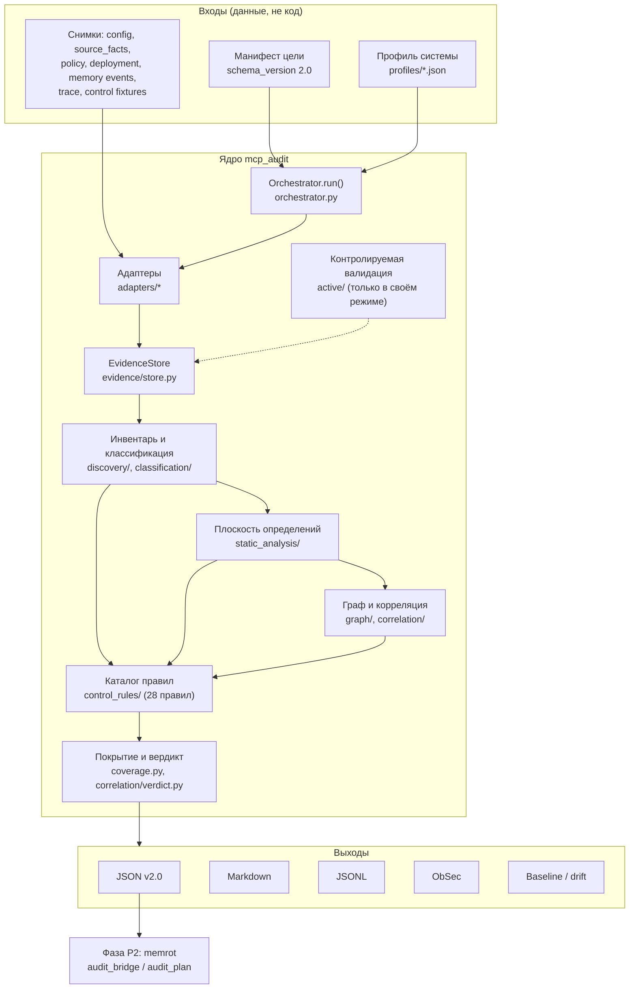
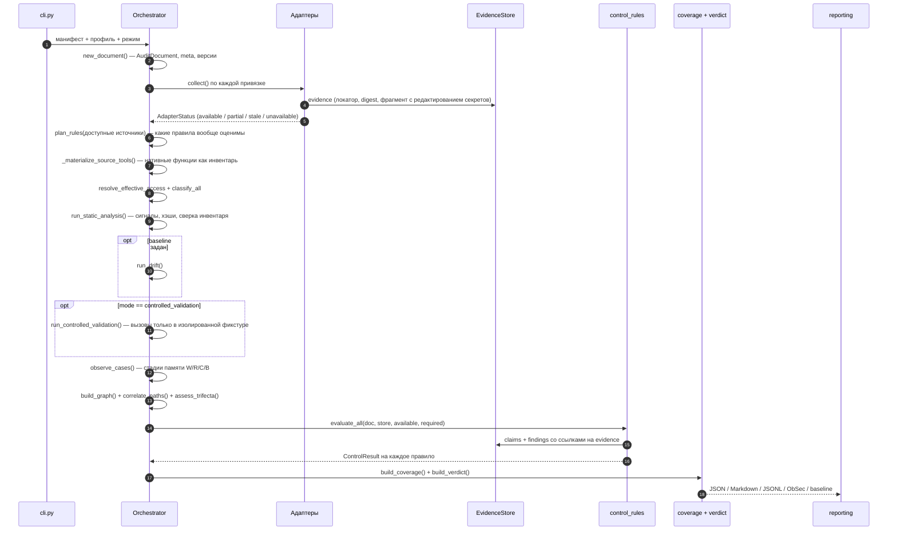
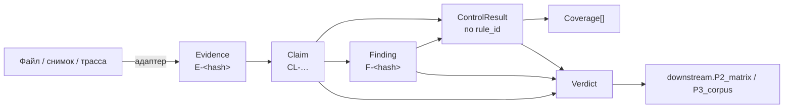
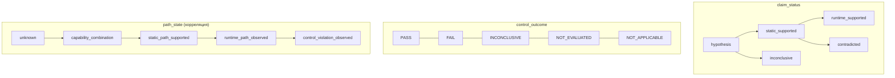
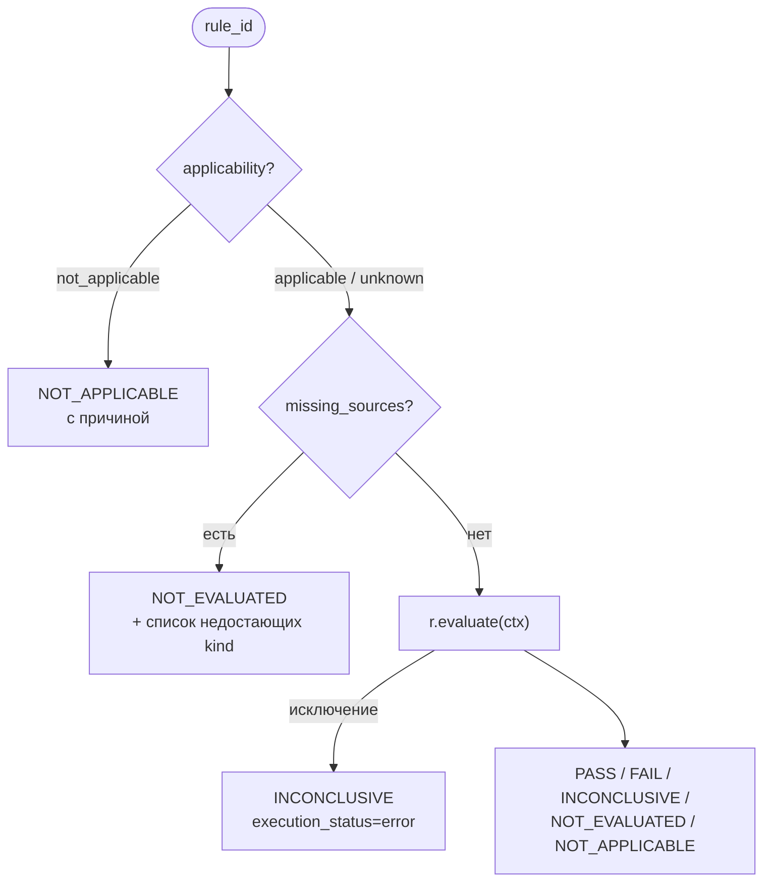
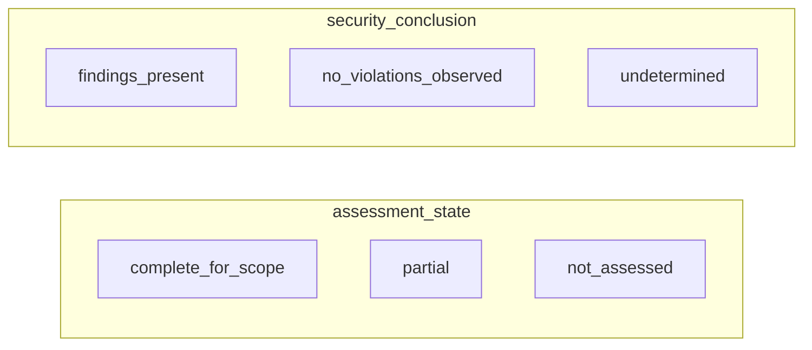
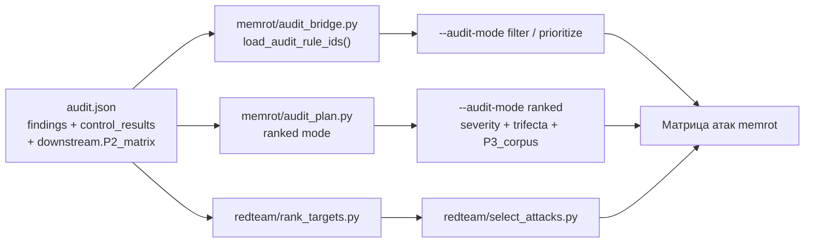

# Как устроен аудит: схема работы

**Что это за документ.** Разбор того, как аудит работает *в коде* этого репозитория:
какие входы он принимает, в каком порядке прогоняет слои, как одно наблюдение
превращается в свидетельство → утверждение → находку → вердикт, и как результат
попадает в атакующую фазу. Документ — карта по реализации, а не спецификация.

| Если нужно | Смотреть |
|---|---|
| Требования, принципы и обоснование архитектуры (ТЗ) | [`audit_subsystem_architecture.md`](audit_subsystem_architecture.md) |
| Как запускать: команды, флаги, коды выхода | [`auditor.md`](auditor.md) |
| Полный каталог правил (28 шт.) | [`rules_catalog.md`](rules_catalog.md) |
| Форматы входных файлов адаптеров | [`adapters_and_formats.md`](adapters_and_formats.md) |
| Перенос на новую систему | [`porting_to_a_new_stand.md`](porting_to_a_new_stand.md) |
| **Как это работает внутри, сквозным проходом** | этот файл |

Пакет: `mcp_audit/` (фаза пайплайна P1, Audit / Inventory). Версии разделены
намеренно (`mcp_audit/__init__.py`): схема отчёта `agent-security-audit` **2.0**,
движок **2.0.0**, каталог правил **2.0.0**.

Объект аудита — жизненный цикл агентной системы (инвентарь, определения,
идентичность, память, наблюдаемое поведение, инфраструктура). MCP — лишь один
из поддерживаемых интерфейсов, несмотря на историческое имя пакета.

---

## 1. Схема верхнего уровня



Два инварианта, которые видны уже на этой схеме:

* **Профиль говорит, где искать; адаптер — что нашёл; правило — что это значит.**
  В правилах нет имён конкретного стенда, они живут в профилях.
* **Отсутствующий источник никогда не превращается в «нарушений нет».** Он даёт
  `NOT_EVALUATED` зависимым правилам и `partial` в вердикте.

---

## 2. Входы

### 2.1 Манифест цели

`mcp_audit/manifest.py`. Описывает идентичность цели, режим, профиль и
привязки адаптеров. Секретов в манифесте быть не может — `_check_no_secrets()`
падает на полях вида `token` / `password` / `api_key`; учётные данные
передаются именем переменной окружения (`credential_binding`).

```json
{
  "schema_version": "2.0",
  "target": {"id": "mempalace-hub", "build_ref": "d9f0590…", "environment": "shared hub"},
  "inspection": {"access_profile": "white_box", "mode": "offline",
                 "profile_ref": "../profiles/mempalace.json"},
  "adapters": [
    {"id": "mcp-config",  "kind": "mcp_inventory",  "binding": {"path": "mempalace.config.json", "live": false}},
    {"id": "source",      "kind": "source_snapshot","binding": {"path": "mempalace.source_facts.json"}},
    {"id": "policy",      "kind": "policy_snapshot","binding": {"path": "mempalace.policy.json"}},
    {"id": "deployment",  "kind": "deployment",     "binding": {"path": "mempalace.deployment.json"}}
  ]
}
```

Обычный MCP-конфиг тоже принимается: `wrap_legacy_config()` оборачивает его в
манифест с единственным адаптером `mcp_inventory` и добавляет ограничение
«идентичность и сборка цели не объявлены».

### 2.2 Профиль системы

`profiles/*.json`, загрузка — `manifest.load_profile()`. Профиль — это
переносимый словарь имён конкретной системы:

| Секция | Что задаёт | Куда попадает |
|---|---|---|
| `components`, `servers` | компоненты, роли, алиасы серверов | граф (`graph/model.py`) |
| `principals`, `boundaries` | субъекты и границы доверия | граф, покрытие границ |
| `memory_stores` | типы памяти и их аудитория | правила MEM-* |
| `source_facts.flows` | где в исходниках искать поток и какими regex его подтвердить | `source_snapshot` → правила |
| `source_facts.auth_transitions`, `token_validation` | переходы авторизации и проверки токена | правила AUTH-* |
| `source_facts.tool_declarations` | стратегия извлечения деклараций (`decorator`, `registry_dict`, `list_literal`, `json_file`) | инвентарь |
| `source_facts.break_points` | точки обрыва (усечение контекста, фильтры) | корреляция |
| `chains` | именованные сквозные цепочки | `graph/correlate.py`, trifecta |
| `lexicon`, `capabilities` | доменные глаголы и заявленные свойства инструментов | `classification/` |
| `tool_routing` | есть ли namespace у роутера | TOOL-03, вердикт |

Профиль проверяется до первого аудита: `python -m mcp_audit lint-profile` —
существование путей, разрешимость символов, компилируемость regex, наличие
`rule_refs` в каталоге и **сколько правил профиль вообще открывает**
(`18/28` с перечислением недостающих источников).

### 2.3 Адаптеры

Контракт — `adapters/base.py`: `kind`, `adapter_version`, `supported`,
`unsupported` (явные причины), `allowed_modes`, метод `collect(doc, store)`.

| kind | Читает | Статусы, которые может вернуть |
|---|---|---|
| `mcp_inventory` | конфиг MCP, снимок прошлого handshake, живой handshake, контекстные файлы агента | `available` / `partial` / `stale` / `unavailable` |
| `source_snapshot` | дерево исходников через `ast` + regex профиля, либо готовый файл фактов | статус на каждый факт: `static_supported` / `contradicted` / `unknown` |
| `policy_snapshot` | ожидаемая политика доступа и памяти | — |
| `memory_event_snapshot` | нормализованные записи памяти и события W/R/C/B | объявленное `coverage` по видам событий |
| `trace` | JSONL-события выполнения | плюс `observation_quality` |
| `deployment` | compose/JSON: публикация портов, имена переменных окружения | значения окружения не читаются |
| `control_fixtures` | зарегистрированные контрольные случаи и декларация изоляции | — |

Свой источник добавляется **без правки пакета**: `--adapter-plugin module:Class`,
поле `adapter_plugins` манифеста или entry point `mcp_audit.adapters`
(`adapters/registry.py`). Плагин, который не импортировался, попадает в
`limitations`, а не молча исчезает.

---

## 3. Конвейер: что происходит за один запуск



Порядок в `Orchestrator.run()` не произвольный:

1. **Сбор** (`collect`). Каждый адаптер оборачивается в `try/except`: падение
   адаптера даёт `unavailable` и частичное покрытие, а не исключение наружу.
   Режим гасит запуск процессов — `live = doc.mode.spawns_processes and binding.live`,
   поэтому в `offline` handshake физически не выполняется.
2. **План применимости** (`control_rules.plan`) считается сразу после сбора, по
   фактически доступным `kind`-ам. Он попадает в отчёт (`plan`) до всяких выводов.
3. **Материализация нативных инструментов** — декларации из исходников становятся
   записями инвентаря с единственным источником `source_defined` и пометкой, что
   handshake не выполнялся.
4. **Доступ и классификация** до линтера: у инструмента появляются `operations`,
   `side_effects`, `classification_basis`, а доступ раскладывается на
   `policy_expected` / `inferred` / `observed`.
5. **Плоскость определений** — линтер описаний, анализ схем, коллизии имён,
   версионированный хэш (`sha256:c2:…`), сверка инвентаря. Всё это **сигналы**
   со статусом `hypothesis`, а не находки.
6. **Контролируемая валидация** — только в своём режиме и только по
   зарегистрированным случаям.
7. **Граф и корреляция** — после того как все компоненты существуют.
8. **Правила** — последними, когда все источники уже разложены по документу.
9. **Покрытие и вердикт** — считаются из результатов правил, а не наоборот.

Если на любом шаге вылетает исключение, документ получает `status = "failed"`,
причина попадает в `limitations`, и вердикт всё равно строится — как
`not_assessed` / `undetermined`. Зелёного результата у упавшего аудита не бывает.

---

## 4. Модель данных: от файла до вердикта



| Сущность | Ключевые поля | Правило, которое держит код |
|---|---|---|
| `Evidence` | `source_type`, `method`, `locator`, `digest`, `fragment`, `scope`, `limitations` | ID детерминирован (`stable_id` от типа, метода, локатора и digest), фрагмент обрезается и проходит `redact_secrets()` |
| `Claim` | `statement`, `claim_status`, `evidence_refs`, `confidence` (качественная), `limitations` | ссылка на несуществующее свидетельство — `ValueError`; `runtime_supported` без `runtime_trace`/`fixture_observation` не создаётся; `static_supported` без свидетельств деградирует в `hypothesis` |
| `ControlResult` | `control_outcome`, `execution_status`, `applicability`, `missing_sources`, `method` | выполнение и исход контроля — разные поля; в покрытие идут только `PASS`/`FAIL` |
| `Finding` | `finding_id`, `rule_id`, `requirement`, `expected_invariant`, `observed_effect` vs `potential_effect`, `severity` vs `potential_severity`, `closure_criterion`, `memory_stages` | ID стабилен (правило + код + границы + компоненты + scope), поэтому один дефект, найденный дважды, сливается в одну находку |
| `Coverage` | числитель, знаменатель, источник знаменателя, `unknown`, `gaps` | при нулевом/неизвестном знаменателе — «не определено», не 100 % |
| `Verdict` | две независимые оси + `basis` (список claim id) | `security_conclusion` не улучшается от того, что оценка неполная |

### Шкалы



`static_supported` — достаточное основание для находки о дефекте кода или
конфигурации, но **не** наблюдаемое влияние на модель. `runtime_supported`
подтверждает только явно сформулированное утверждение в своей области.

### Сквозной пример (реальный прогон на `examples/mempalace.manifest.json`)

```
Evidence  E-153c73168a   source_code / static_analysis
          locator: mempalace/mcp_server.py :: tool_event_list, строки 4921–4967
   ↓
Claim     CL-MEM-01-F-event-read   static_supported, confidence=medium
          «Чтение событий фильтруется параметром to_agent, который выбирает сам
           вызывающий: привязки к аутентифицированному агенту нет»
          limitations: ACL работающего развёртывания не проверен
   ↓
Finding   F-7fa1b06531   MEMORY_ISOLATION_MISSING, severity HIGH,
          verification_status = static_supported,
          closure_criterion: «пути чтения персональных типов несут фильтр аудитории»
   ↓
Control   MEM-01 → FAIL (method = static_analysis, finding_refs=[F-7fa1b06531])
   ↓
Verdict   basis содержит CL-MEM-01-F-event-read
   ↓
P2        downstream.P2_matrix → {"id": "TM-MEM-01", "state": "fail",
                                  "claim_status": "static_supported"}
```

Ни на одном шаге статус не повышается: в P2 уезжает `static_supported`, а не
«подтверждено».

---

## 5. Правила

### 5.1 Анатомия правила

`control_rules/base.py`. Правило — это данные плюс одна функция `evaluate`:

```python
Rule(
    rule_id="MEM-02", version="2.0.0", domain="memory", stage="B",
    requirement="…",                     # что именно нарушается
    criterion="…",                       # критерий исхода
    expected_invariant="…",              # что должно быть верно
    required_sources=[["source_snapshot"],                      # альтернативы:
                      ["policy_snapshot", "source_snapshot"],   # достаточно одного
                      ["memory_event_snapshot"]],               # полного набора
    methods=[Method.STATIC_ANALYSIS, …],
    known_false_positives=[…], limitations=[…],
    remediation_criterion="…", external_refs=[…],
    evaluate=_eval_mem_02,
)
```

`RuleContext` даёт правилу типизированный доступ к документу: `ctx.flows(kind)`,
`ctx.policy`, `ctx.facts`, `ctx.has(kind)`, `ctx.chain_state(rule_id)`, а также
фабрики `ctx.claim()` и `ctx.finding()`, которые сами проставляют `rule_id`,
`rule_version`, `requirement` и `expected_invariant`.

### 5.2 Как правило исполняется



Ошибка в самом правиле видна как `INCONCLUSIVE` с `execution_status=error` — она
никогда не выглядит как зелёный результат (`catalog.evaluate_all`). Когда одно
правило оценивает несколько потоков, итог сводится через `worst()`:
`FAIL > INCONCLUSIVE > PASS > NOT_EVALUATED > NOT_APPLICABLE`.

### 5.3 Каталог: 28 правил

| Домен | ID | Тема | Минимально нужные источники |
|---|---|---|---|
| memory | MEM-01…07 (этап B) | изоляция памяти, разделение записи и публикации политики, владелец и область, данные vs инструкции, происхождение при преобразовании, отсутствие авто-повышения доверия, изоляция retrieval/кэша | `source_snapshot` или `memory_event_snapshot` / `trace` |
| memory | MEM-08…10 (этап D) | отзыв производных данных, корректность фоновых операций, управляемое хранение | `memory_event_snapshot`, `policy_snapshot`, `control_fixtures` |
| identity | AUTH-01…05 (B), AUTH-06 (D) | доверенная входная идентичность, авторизация на конкретный ресурс, серверная политика, проверка issuer/audience токена, ограниченное делегирование, применение изменений полномочий | `source_snapshot` (+`policy_snapshot`), `trace`, `control_fixtures` |
| infrastructure | INFRA-01…03 | права доступа к памяти, наблюдаемая сетевая граница, изоляция проверочного окружения | `deployment`, `policy_snapshot`, `control_fixtures` |
| tools | TOOL-01…05 | контроль одобренных определений, корректность контракта операции, однозначность имён, «результат инструмента остаётся данными», обоснованность текстовых сигналов | `mcp_inventory` (+`baseline`), `source_snapshot`, `trace` |
| egress | EGRESS-01…02 | контроль передаваемых данных, наблюдаемость внешних эффектов | `source_snapshot`+`policy_snapshot`, `control_fixtures` |
| inventory | INV-01…02 | согласованность инвентаря между источниками, полнота и свежесть discovery | `mcp_inventory` в паре с чем-либо |

Каталог генерируется из кода: `python -m mcp_audit rules --markdown > docs/rules_catalog.md`.
Правила этапа D — roadmap: они оцениваются, если источники позволяют, и иначе
остаются `NOT_EVALUATED` с пометкой.

---

## 6. Режимы

| Режим (`--mode`) | Что делает код | Допустимый вывод |
|---|---|---|
| `offline` (по умолчанию) | только разбор переданных файлов; `spawns_processes = False` | статические факты, предположения, расхождения |
| `live-inventory` | handshake с сервером; stdio-процесс получает **минимальное окружение** (allow-list, `introspector.minimal_env`) | каталог, объявленный этой идентичности в этот момент |
| `trace-review` | разбор событий выполнения и памяти | только то, что видно в событиях, с их покрытием |
| `controlled-validation` | `active/runner.py` по зарегистрированным случаям; требует `--sandbox` **и** `MCP_AUDIT_SANDBOX=1` | конкретный инвариант в границах фикстуры |
| `baseline-comparison` | сравнение совместимых снимков | классифицированные изменения с `approval_state` |

Старые имена `passive` / `active` / `drift` принимаются как синонимы
(`LEGACY_MODE_ALIASES`). `--access-profile black_box|grey_box|white_box` — независимая
ось: grey-box аудит может быть полностью offline.

В `controlled-validation` разделены три вещи (`active/runner.py`):

| | Значения |
|---|---|
| `execution_status` | completed / error / timeout / skipped |
| `error_class` | authorization_refusal / schema_error / unknown_tool / transport_error / timeout / tool_error |
| `control_outcome` | PASS / FAIL / INCONCLUSIVE / NOT_EVALUATED / NOT_APPLICABLE |

Эффект наблюдается независимо от текста ответа там, где это возможно
(`file_exists`, `file_absent`, `sink_received`): строка «готово» не доказывает
изменение состояния, а отказ по недействительному токену не доказывает
разграничение объектов. `IsolationGuard` честно разделяет **декларацию намерения**
(флаг + переменная окружения) и **технические факты** (маркер контейнера,
аттестация фикстуры) — локальные факты не доказывают изоляцию удалённой цели.

---

## 7. Покрытие и вердикт

`coverage.py` считает 13 независимых метрик; единого «процента безопасности» нет.

| Метрика | Числитель / знаменатель |
|---|---|
| `inventory_completeness` | найденные имена / эталонный список из профиля или политики |
| `component_coverage` | компоненты, затронутые PASS/FAIL или находкой / все компоненты |
| `mandatory_control_coverage` | PASS+FAIL / обязательные правила минус обоснованно неприменимые |
| `…_static`, `…_runtime` | то же, но раздельно по методам |
| `identity_coverage` | отношения политики с хотя бы одним проверенным переходом |
| `memory_stage_W/R/C/B` | наблюдённые стадии / применимые случаи памяти |
| `boundary_coverage` | границы, до которых дошла оценка |
| `execution_quality` | корректно завершённые контрольные случаи (ошибки **не** исключаются) |
| `observation_quality` | события трассы с обязательными полями |

`INCONCLUSIVE` и `NOT_EVALUATED` остаются в знаменателе — иначе неполный аудит
выглядел бы полным.

Вердикт (`correlation/verdict.py`) — две независимые оси:



* `partial + findings_present` — честное «дефект есть, покрытие неполное».
* `no_violations_observed` выдаётся **только** при `complete_for_scope` и когда все
  обязательные контроли — `PASS`/`NOT_APPLICABLE`.
* Любой нерешённый контроль, отсутствующий адаптер или `partial`/`stale` источник
  переводят оценку в `partial`.
* `confidence` — качественная (low/medium/high/unknown) с объяснением; фиксированных
  чисел нет.
* `release_decision` делегирован ObSec: неизвестный обязательный контроль никогда
  не становится разрешением.

Коды выхода CLI: `0` чисто, `1` подтверждённые находки, `2` неполная оценка,
`3` дрейф, `4` ошибка аудита. Важная деталь реализации: ненулевые коды по находкам
выдаются **только с `--gate`** (`cli._exit_code`), а `--strict` превращает ошибки
валидации отчёта в код `4`.

---

## 8. Отчёты

`reporting/` строит все форматы из одного проверенного документа, поэтому они не
могут противоречить друг другу. Верхний уровень JSON — 28 ключей:

```
schema, schema_version, meta, target, adapters, plan, inventory, components,
principals, capabilities, memory_stores, boundaries, edges, definition_analysis,
evidence, claims, control_results, findings, tests, memory_cases, coverage,
trifecta, summary, verdict, downstream, drift, import_history, limitations
```

* **Markdown** — из той же модели; недоверенные фрагменты экранируются (`esc()`),
  HTML не исполняется, внешнее содержимое не подгружается.
* **JSONL** — по строке на evidence / claim / control result / finding.
* **ObSec** (`reporting/obsec.py`) — экспорт для релизного гейта.
* **Baseline / drift** (`reporting/baseline.py`) — снимок с идентичностью
  (цель, сборка, среда, роль discovery, версии схемы/канонизации/правил) плюс
  дайджесты политики, прав сервисов, схемы памяти, retrieval/egress и инвентаря.
  Сравнение сначала проверяет **совместимость**, затем классифицирует изменения
  (added / removed / definition_changed / policy_changed / access_changed /
  runtime_config_changed / coverage_changed / comparison_inconclusive) с
  `approval_state`. Новый снимок не становится одобренным оттого, что его сделал
  аудитор.

Отчёт валидируется на выходе: `validation/schema.py` проверяет структуру (JSON
Schema, если установлен `jsonschema`, иначе stdlib-подмножество) и семантику —
ссылочную целостность claims → evidence, findings → claims, `verdict.basis` → claims,
`runtime_supported` без runtime-свидетельства, дубликаты `finding_id`,
несовместимую сборку свидетельств.

---

## 9. Что аудит отдаёт дальше (P1 → P2)



Связь **разомкнутая**: `memrot` не импортирует `mcp_audit`, а читает JSON и
работает со строковым словарём `rule_id`.

* `audit_bridge.load_audit_rule_ids()` берёт `control_results` с `FAIL`, объединяет
  с `TM-<rule_id>`-строками P2 и, если FAIL-ов нет, откатывается к `rule_id` всех
  находок — чтобы неполный снимок всё равно запускался.
* `audit_plan.py` добавляет режим `ranked`: severity (`effective_severity` или
  `severity`), участие узла в trifecta-цепочках, буст по `downstream.P3_corpus`,
  плюс таблицы соответствия `rule_id → OWASP AMG category` и
  `rule_id → technique_category` из `memrot/taxonomy.py`.
* `redteam/rank_targets.py` делает то же для отдельной, более узкой сборки
  сценариев и печатает цели по убыванию severity с локатором кода.

Downstream-потребитель не имеет права переименовать гипотезу в подтверждённый
результат: `claim_status` едет вместе со строкой.

---

## 10. Реальный прогон (проверяемый)

```bash
python -m mcp_audit audit examples/mempalace.manifest.json --json mp.json --md mp.md
```

Результат (режим `offline`, четыре адаптера — все `available`):

```json
{"status": "partial", "assessment_state": "partial",
 "security_conclusion": "findings_present",
 "confirmed_findings": 11, "hypotheses": 3,
 "unresolved_controls": ["MEM-06","MEM-08","MEM-10","AUTH-03","AUTH-05","AUTH-06",
                         "INFRA-01","TOOL-01","TOOL-02","TOOL-04","TOOL-05","INV-02"],
 "validation_errors": 0, "exit_code": 0}
```

Как это читать:

| Показатель | Значение | Что означает |
|---|---|---|
| `plan.planned` | 25 из 28 | три правила отсечены нехваткой источников ещё до оценки |
| `control_results` | 8 FAIL, 6 PASS, 3 INCONCLUSIVE, 9 NOT_EVALUATED, 2 NOT_APPLICABLE | «не оценено» отделено от «нарушений нет»; итоговых `NOT_EVALUATED` больше, чем в плане: часть правил доходит до `evaluate`, но не находит внутри профиля нужного факта |
| `mandatory_control_coverage` | 14 / 26 | оценена чуть больше половины обязательных контролей |
| `mandatory_control_coverage_runtime` | 0 / 26 | наблюдений времени выполнения не было вовсе |
| `memory_stage_W/R/C/B` | `null / null` | случаев памяти нет → «не определено», а не 0 % |
| `evidence / claims / findings` | 103 / 112 / 14 | каждая находка прослеживается до локатора в исходниках |
| `exit_code` | `0` | без `--gate` находки не влияют на код выхода |

---

## 11. Инварианты, которые держит код

1. **Отсутствующий адаптер ≠ чистый результат.** `plan` фиксирует нехватку,
   правило даёт `NOT_EVALUATED`, вердикт — `partial`
   (`tests/test_adapters.py::test_missing_adapter_is_not_evaluated_and_never_green`).
2. **Конфиг не подделывает handshake.** `handshake.performed = false`, `ok = null`,
   `source = config`.
3. **`offline` ничего не запускает.** Запуск процессов привязан к свойству режима,
   а не к флагу вызова.
4. **Секреты не доезжают до отчёта.** `redact_secrets()` на входе в хранилище
   свидетельств; манифест с секретоподобным полем отклоняется.
5. **Недоверенный текст не меняет поведение аудитора.** Описания инструментов,
   инструкции сервера, результаты и логи — данные; они не могут расширить scope,
   поменять настройки или одобрить baseline
   (`tests/test_adapters.py::test_untrusted_content_cannot_change_auditor_settings`).
6. **Unknown остаётся unknown.** Владелец записи памяти не подставляется, `trusted=true`
   из содержимого хранится отдельно как `self_asserted`, `enforcement = unknown`
   без политики или наблюдения.
7. **Один дефект — одна находка.** Стабильный `finding_id` сливает повторные
   сообщения об одной причине (`test_rules_stand::test_one_defect_one_stable_finding`).
8. **Возможность ≠ уязвимость.** `capability_indicators` — отдельные утверждения:
   одна разрешённая запись не означает полного доступа к проекту.
9. **Trifecta — индикатор сочетания возможностей**, а не доказательство утечки;
   возможности разных субъектов, развёртываний и security-профилей не склеиваются
   в одну цепочку (`graph/correlate._same_scope`).
10. **Упавший аудит не бывает зелёным** — `failed` → `not_assessed` / `undetermined`.

---

## 12. Карта кода

| Модуль | Ответственность | Ключевые точки входа |
|---|---|---|
| `mcp_audit/cli.py` | подкоманды, коды выхода | `audit`, `baseline`, `drift`, `validate`, `migrate`, `rules`, `lint-profile`, `source-snapshot` |
| `mcp_audit/orchestrator.py` | порядок слоёв, обработка сбоев | `Orchestrator.run()`, `audit_from_manifest()`, `audit_from_config()` |
| `mcp_audit/manifest.py` | манифест v2, обёртка legacy-конфига, профили | `load_manifest`, `wrap_legacy_config`, `load_profile` |
| `mcp_audit/models.py` | все сущности отчёта, словари статусов, стабильные ID | `AuditDocument`, `Finding.stabilize`, `stable_id` |
| `mcp_audit/evidence/` | свидетельства и утверждения, редактирование секретов | `EvidenceStore.add`, `EvidenceStore.claim` |
| `mcp_audit/adapters/` | источники данных и реестр плагинов | `Adapter.collect`, `registry.load_plugin` |
| `mcp_audit/discovery/` | разбор конфига, handshake, контекстные файлы | `introspect_server`, `minimal_env` |
| `mcp_audit/static_analysis/` | сигналы определений, схемы, коллизии, хэши, сверка | `run_static_analysis`, `reconcile_inventory` |
| `mcp_audit/classification/` | операции, эффекты, основания, доступ, лексикон | `classify_all`, `resolve_effective_access` |
| `mcp_audit/memory/`, `identity/`, `graph/` | стадии памяти, переходы авторизации, граф и пути | `observe_cases`, `AccessTransition`, `build_graph`, `correlate_paths` |
| `mcp_audit/control_rules/` | каталог правил и драйвер оценки | `plan`, `evaluate_all`, `Rule` |
| `mcp_audit/active/` | фикстуры, изоляция, исполнение случаев | `IsolationGuard`, `run_controlled_validation` |
| `mcp_audit/correlation/` | trifecta, индикаторы возможностей, вердикт | `assess_trifecta`, `build_verdict` |
| `mcp_audit/coverage.py` | метрики покрытия | `build_coverage` |
| `mcp_audit/reporting/` | JSON/MD/JSONL/ObSec, baseline и drift | `emit_json`, `emit_markdown`, `run_drift` |
| `mcp_audit/validation/` | структурная и семантическая проверка, линтер профиля | `validate_document`, `lint_profile` |
| `mcp_audit/migration/` | импорт отчётов v1.0/v1.1 | `load_legacy_audit` |

Тесты по слоям: `tests/test_adapters.py`, `test_rules_stand.py`, `test_memory_rules.py`,
`test_trifecta_and_verdict.py`, `test_active_live.py`, `test_active_isolation.py`,
`test_emit_and_drift.py`, `test_rest_native_profile.py`, `test_mempalace_profile.py`,
`test_migration.py`, `test_cli.py`.

---

## 13. Как расширять

| Задача | Что менять | Чего **не** менять |
|---|---|---|
| Новая система под аудит | профиль (`profiles/*.json`) + манифест + снимки | ядро, правила |
| Новый вид источника | адаптер-плагин (`--adapter-plugin`, entry point) | реестр внутри пакета |
| Новый домен-глагол для классификации | `profile.lexicon` | `classification/classifier.py` |
| Новое контрольное требование | `control_rules/<domain>_rules.py` + версия каталога | форма finding и вердикта |
| Проверить профиль до аудита | `python -m mcp_audit lint-profile <profile> --root <src> --sources …` | — |

Критерий переносимости, который проверяется тестами: один каталог контролей
работает минимум на двух разных системах без ветвлений по названиям стенда в ядре.

---

*Аудит — диагностика, а не защита. Активная плоскость исполняется только в
изолированной фикстуре по зарегистрированным случаям.*
