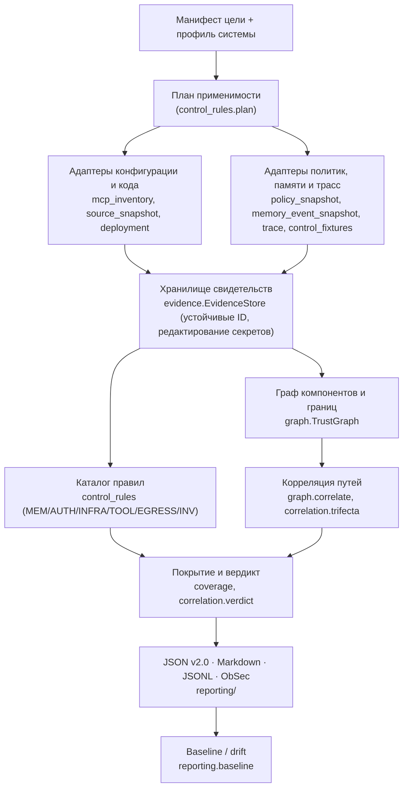
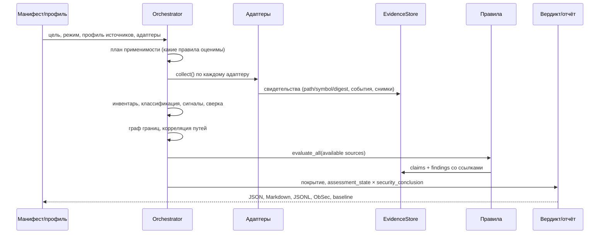

# Архитектура аудита безопасности агентных систем

**Версия документа:** 2.0 (целевой формат отчёта `agent-security-audit` 2.0, движок `mcp_audit` 2.0.0, каталог правил 2.0.0).
**Место в пайплайне:** фаза P1 (Audit / Inventory).
**Входы:** конфигурации и определения интерфейсов (MCP, REST, встроенные функции), исходники, политики доступа и памяти, снимки памяти и трассы, снимки deployment, контрольные фикстуры.
**Выход:** канонический JSON v2.0 + Markdown из той же модели + экспорт в ObSec; свидетельства, утверждения, результаты контролей, покрытие и ограничения — обязательные части каждого отчёта.
**Канонический пакет:** корневой `mcp_audit/`. Вложенная копия `aith_redteaming/` на стендовой ветке считается устаревшим дублем и подлежит замене ссылкой на этот пакет (см. §13).

Документ описывает архитектуру контроля и критерии проверки на собственных фикстурах. Он **не** является отчётом об успешно выполненных воздействиях на модель: примеры в `examples/` получены в режиме `offline` из снимков, стенд и MCP-процессы не запускались.

---

## 0. Что аудит должен производить

Аудит отвечает на пять вопросов:

1. Какие компоненты, данные, инструменты и фоновые операции доступны системе?
2. Кто имеет право читать, изменять и публиковать эти данные?
3. Где недоверенное содержимое может получить дополнительные полномочия, включая переход в общую память или политику?
4. Какая часть каждого вывода подтверждена конфигурацией, кодом, политикой доступа или наблюдением выполнения?
5. Какие границы проверены, какие не проверены и какие доработки закроют обнаруженный разрыв?

Объект аудита — жизненный цикл агентной системы, а не только MCP-инструменты. MCP остаётся одним из поддерживаемых интерфейсов; память, API, фоновые обработчики, встроенные функции, хранилища и межсервисная авторизация учитываются независимо от наличия MCP. Для каждого finding обязательны основания (claims / evidence), статус подтверждения, покрытие и ограничения; косметика без изменения схемы, сборщиков, правил и вердикта не допускается.

---

## 1. Принципы

### 1.1 Шесть плоскостей аудита

| Плоскость | Вопрос | Модули |
|---|---|---|
| Инвентарь и возможности | что есть и что технически возможно | `adapters/mcp_inventory`, `adapters/source_snapshot`, `classification/` |
| Определения и контекст | что написано в определениях, инструкциях сервера, контекстных файлах | `static_analysis/` |
| Идентичность и авторизация | кто и на каком переходе получает право на объект | `identity/`, `control_rules/auth_rules` |
| Память | кто пишет, кто публикует, кто читает, что попадает в контекст, что отзывается | `memory/`, `control_rules/memory_rules` |
| Наблюдаемое поведение | что произошло в трассе или в контролируемой фикстуре | `adapters/trace`, `active/` |
| Инфраструктура | права сервисов, сетевая граница, изоляция проверочного окружения | `adapters/deployment`, `control_rules/infra_rules` |

### 1.2 Независимые характеристики каждого утверждения

Единая шкала `declared → effective → verified` заменена независимыми полями `Claim` (ТЗ §12.1):

| Поле | Значения |
|---|---|
| `source_type` | config, definition, source_code, policy_snapshot, deployment_snapshot, memory_snapshot, runtime_trace, fixture_observation, baseline, imported |
| `method` | parsing, static_analysis, policy_inspection, observation, controlled_validation, import |
| `claim_status` | hypothesis, static_supported, runtime_supported, contradicted, inconclusive |
| `evidence_refs` | идентификаторы свидетельств (устойчивые, `E-<hash>`) |
| `scope` | сборка, среда, субъект/роль, компонент, ресурс, конфигурация |
| `confidence` | low / medium / high / unknown с пояснением; числовой score не используется |
| `limitations` | неизученные условия, отсутствующие трассы, неполнота происхождения |

`static_supported` — достаточное основание для finding о дефекте кода/конфигурации, но не наблюдаемое влияние на модель. `runtime_supported` подтверждает только явно сформулированное утверждение в установленной области и требует свидетельства с `source_type ∈ {runtime_trace, fixture_observation}` (валидатор это проверяет). Происхождение описывает, откуда взято свидетельство; доверие к сборщику не делает содержание истинным.

Термины (ТЗ §4): область видимости, полномочие записи, авторитет содержимого, достоверность факта, происхождение, возможность, уязвимость, наблюдение, finding — различаются. `scope=global` сам по себе не уязвимость; проблема — когда недоверенный источник сам определяет аудиторию или получает полномочие публикации. Поля `scope` / `tenant_id` / `user_id` в документе не доказывают исполнение контроля доступа.

---

## 2. Компонентная архитектура

Переносимое ядро оценивает заранее определённые требования и не расширяет область проверки по тексту внешнего источника. Подключение второго семейства хранилищ или системы без MCP меняет адаптер и профиль, но не семантику правил и не структуру finding (проверено вторым профилем `profiles/rest_native_agent.json`).

---

## 3. Слои

### 3.1 Discovery — инвентарь и его свежесть

Для каждого компонента учитываются раздельно `configured`, `source_defined`, `live_advertised`, `runtime_observed`, `policy_authorized` (`inventory.servers[].inventory_sources`). Сверка (`static_analysis/reconcile.py`) выполняется после сопоставления ID сервера, сборки, роли и времени снимка; сравниваются имена, схемы, `required` и типы параметров. Расхождение требует причины (`profile.inventory_differences`) и не трактуется автоматически как скрытый инструмент — INV-01 даёт `INCONCLUSIVE` с finding-гипотезой.

Обязательные свойства слоя:

- config никогда не создаёт фиктивный handshake: `handshake.performed = false`, `ok = null`, `source = config`;
- offline-режим не запускает команды из конфигурации и не подключается к серверам; live inventory спавнит stdio-процесс с **минимальным окружением** (allow-list + явный `env` из конфига) и записывает идентичность, время и полноту (`complete` / `partial` / `unavailable` / `stale`);
- пагинация сохранена и дополнена контролем повторов и предельного числа страниц;
- встроенные инструменты (декларации `@tool` в исходниках), обработчики завершения сессий, фоновые задачи и записи памяти входят в инвентарь и в карту компонентов даже без MCP-декларации;
- исходное определение хранится в `definition.raw`; нормализованная копия для линтера отдельна — Unicode-анализ не уничтожает байты доказательства;
- отказ discovery виден (INV-02); при несовпадении схем результат вызова не используется как доказательство безопасности (TOOL-02 фиксирует расхождение до интерпретации проверки).

На стенде `9/14` — доля совпадающих имён MCP-инструментов между конфигурационным примером и серверным исходником. Это не процент проверенной безопасности и не измерение работающего deployment (`reconciliation[].ratio_note`).

### 3.2 Static analysis — определения, результаты, производный контент

Источники риска разделены (ТЗ §10.1): definition (описание, схема, annotations, server instructions), tool result, производный ответ, производная память. Линтер (`description_linter`, `schema_analyzer`, `collision_detector`, `mcp_scan`) выдаёт **сигналы**: каждый с фрагментом, правилом и объяснением, статус `hypothesis` под TOOL-05. Императив, Unicode или ссылка сами по себе не доказывают вредоносность; наличие подозрительного описания не доказывает право менять сервер. Хэши определений версионированы (`sha256:c2:…`), смена канонизации не выглядит как изменение цели.

### 3.3 Classification — операции, эффекты, основания

Единственный класс READ/WRITE/EXEC/DELETE сохранён как первичный и дополнен независимыми свойствами (ТЗ §7): `operations` (READ, CREATE, UPDATE, DELETE, EXECUTE, PUBLISH, TRANSMIT), `side_effects` (эффекты других компонентов с причинной ссылкой; они не меняют класс инструмента), `executing_principal`, `phase`, `target_scope`, `classification_basis` (definition / source_inference / policy_snapshot / runtime_observation), `knowledge_state`. Доступ разделён на `policy_expected` (заявления автора конфига, включая конвенциональные запреты аудитора, помеченные как ожидание, а не ACL), `inferred` (предположение по типу сервера и аргументам) и `observed` (только из фикстур/трасс); `enforcement = unknown`, пока нет политики или наблюдения. `capability_risk` — потенциальный ущерб возможности, не серьёзность finding. WRITE сам по себе не создаёт вывод о полном доступе к проекту.

### 3.4 Controlled validation — контролируемые проверки

Только в режиме `controlled_validation`, только в изолированной фикстуре, только по **зарегистрированным** случаям с договорёнными схемами (`active/fixtures.py`). Семантика (ТЗ §12.2):

| Условие | Наблюдение | Исход |
|---|---|---|
| разрешённая операция должна работать | подтверждён разрешённый эффект | PASS |
| запрещённый эффект должен отсутствовать | отказ политики, эффекта нет | PASS |
| запрещённый эффект должен отсутствовать | эффект наблюдался | FAIL |
| разрешённая операция должна работать | необоснованный отказ | FAIL (функциональный случай) |
| любое требование | неверная схема, неизвестный инструмент, тайм-аут, транспорт | INCONCLUSIVE |
| применимо, но не выполнялось | нет наблюдения | NOT_EVALUATED |
| возможность отсутствует и это установлено | основание неприменимости | NOT_APPLICABLE |

`execution_status` (completed / error / timeout / skipped) и `error_class` (authorization_refusal, schema_error, unknown_tool, transport_error, timeout, tool_error) хранятся отдельно от `control_outcome`. «Blocked» — наблюдение, не универсальная оценка; отказ из-за недействительного токена не подтверждает разграничение объектов. Эффект наблюдается независимо от текста ответа, где это возможно (`file_exists`, `file_absent`, `sink_received`); строка «готово» не доказывает изменение состояния. `IsolationGuard` — декларация намерения (флаг + переменная окружения), техническая изоляция — отдельные факты и аттестация фикстуры (INFRA-03). `allow_destructive` по умолчанию выключен; ограничены время, число операций и размер ответов.

### 3.5 Memory lifecycle — память как самостоятельный объект

Карта жизненного цикла (ТЗ §8.1) реализована как потоки профиля, проверяемые адаптером исходников, и как события памяти/трассы: получение, производный ответ, извлечение кандидата, авторизация записи, публикация, хранение, извлечение, сборка контекста, использование, отзыв. Нормализованная запись памяти (`memory/model.py`) содержит идентификаторы, владение, доступ, авторство, происхождение, согласование, жизненный цикл и содержимое; неизвестные значения остаются неизвестными, владелец не подставляется, `trusted=true` из содержимого хранится отдельно как `self_asserted`. Стадии W / R / C / B фиксируются раздельно со значениями observed / not_observed / unknown / not_evaluated; `not_observed` допустим только при достаточном покрытии событий. Подготовка записи администратором фикстуры даёт ограничение автоматически. Правила MEM-01…MEM-10 — в `docs/rules_catalog.md`.

### 3.6 Identity & Authorization

Для каждого перехода хранится запись `входная идентичность → исполняющий сервис → операция → ресурс → решение политики → следующий сервис` (`identity/model.py`, `auth_transitions` профиля). Успешный отказ на входе не подтверждает бэкенд, до которого запрос не дошёл: AUTH-02 оценивает каждый переход отдельно. Для JWT проверяются issuer, audience, подпись, время и алгоритм (RFC 8725 §3.8–3.9); для API-ключей и сессий — эквивалентные требования схемы; отсутствие JWT не означает провал AUTH-04. Делегирование (AUTH-05) должно быть привязано к субъекту; клиентские параметры не могут ослаблять обязательные проверки (AUTH-03).

### 3.7 Correlation — связность и границы

`LETHAL_TRIFECTA` сохранён как индикатор сочетания возможностей; коррелятор различает `capability_combination`, `static_path_supported`, `runtime_path_observed`, `control_violation_observed`, `unknown` (`graph/correlate.py`). Граф содержит компоненты, хранилища, субъектов, издателей и точки контроля; у каждого ребра — основание, условия, ожидаемая граница, область и состояние. Возможности разных субъектов, deployment или security-профилей не объединяются в одну цепочку; runtime-подтверждение одного ребра не переносится на остальные. Связь «преобразование диалога → публикация политики» — самостоятельный дефект (MEM-02, TOOL-04), внешний канал для него не требуется. Точки обрыва (усечение контекста, фильтры) входят в результат; усечение по длине не считается устойчивым контролем.

### 3.8 Reporting

Канонический JSON v2.0 (`schemas/agent-security-audit-2.0.schema.json` + семантическая валидация `mcp_audit.validation`), Markdown из того же документа (структура §16.1 ТЗ: цель и пределы; подтверждённые выводы; покрытие; карта компонентов; findings с основаниями и критериями закрытия; память W/R/C/B; авторизация и egress; drift; план исправлений; реестр свидетельств), JSONL и экспорт в ObSec (`reporting/obsec.py`). Устойчивые идентификаторы: `finding_id = F-<hash(rule, code, boundary, component, scope)>`, `instance_id = run:finding`. Недоверенные фрагменты экранируются; HTML не исполняется; внешнее содержимое не подгружается; секреты редактируются на входе в хранилище свидетельств.

---

## 4. Поток данных

Сначала план применимости и сбор свидетельств; затем оценка правил, корреляция и отчёт. Отсутствующий обязательный адаптер даёт `NOT_EVALUATED` зависимым требованиям и неполную оценку — никогда пустой список находок с зелёным вердиктом.

---

## 5. Режимы исполнения и профиль источников

| Режим | Что делает | Допустимые выводы |
|---|---|---|
| `offline` | разбирает переданные конфиги, исходники, схемы и снимки; ничего не запускает | статические факты, предположения, расхождения |
| `live_inventory` | соединяется с разрешённым источником, получает метаданные | объявленный сервером каталог для данной идентичности и момента |
| `trace_review` | анализирует полученные трассы и события | только наблюдаемое в них поведение и ограничения |
| `controlled_validation` | оценивает зарегистрированные контроли на изолированных фикстурах | подтверждение конкретного инварианта в границах фикстуры |
| `baseline_comparison` | сопоставляет совместимые снимки любого режима | изменения и неопределённость сравнения |

Legacy-имена `passive` / `active` / `drift` принимаются как синонимы. Black / grey / white box (`access_profile`) — независимая ось доступных источников: grey-box аудит может быть полностью offline. Live inventory не «без воздействия»: stdio требует запуска процесса, сеть раскрывает факт обращения. Тексты определений, результатов и логов не могут менять scope аудита, инструкции оценщика, разрешения или baseline.

---

## 6. Границы доверия

- MCP-серверы, их `declared_capabilities`, annotations и server instructions недоверенны: annotations описывают поведение, но не обеспечивают его.
- Результаты инструментов, логи, трассы и вывод модели недоверенны: пересказ ассистентом не делает содержимое доверенным; текст ответа «доступ запрещён» не доказывает отсутствие эффекта.
- Содержимое записи памяти не может удостоверить собственный источник, подпись, владельца или проверенность.
- Доверие к сборщику не делает содержание истинным: свидетельство описывает происхождение, уверенность — силу поддержки утверждения.
- Оркестратор, хранилище свидетельств и baseline отделены от attacker-плоскости; новый снимок не становится одобренным только потому, что его создал аудитор.

---

## 7. Контракт данных v2.0

Канонические сущности (`mcp_audit/models.py`): `AuditRun` (meta), `Component`, `Principal`, `Capability`, `MemoryStore`, `TrustBoundary`, `Edge`, `Evidence`, `Claim`, `ControlResult`, `Finding`, `ControlCaseResult`, `Coverage`, `BaselineDiff` (drift), `Verdict`. Обязательные поля finding (ТЗ §15.2): устойчивый `finding_id` и `instance_id`; `rule_id`, `rule_version`, `title`, `root_cause`; `component_refs`, `boundary_refs`, `scope`; `requirement`, `preconditions`, `expected_invariant`; `claim_refs`, `evidence_refs`, `verification_status`; `observed_effect` и `potential_effect` раздельно; `severity` / `potential_severity` с обоснованием; `remediation`, `remediation_owner`, `remediation_priority`, `closure_criterion`; `limitations`, `unconfirmed`, `related_findings`; `first_seen`, `last_seen`, `remediation_state`, `reassessment`; `memory_stages`. Флагов `verified=true` у инструмента или отчёта нет; `verdict.basis` — список идентификаторов claims.

Сокращённый пример статического вывода — ТЗ §15.3; полный пример — `examples/genai_invest_stand.audit.json`. Семантическая валидация (`python -m mcp_audit validate report.json`) проверяет ссылочную целостность (evidence / claims / verdict.basis), `runtime_supported` без runtime-свидетельства, `complete_for_scope` при нерешённых контролях, несовместимую сборку свидетельств, дубликаты `finding_id`. Минимальная трассировка событий — `docs/adapters_and_formats.md`.

Вердикт имеет две независимые оси: `assessment_state` (complete_for_scope / partial / not_assessed) и `security_conclusion` (findings_present / no_violations_observed / undetermined). `partial + findings_present` честно сообщает о дефекте при неполном покрытии. Severity, статус подтверждения, `remediation_priority` и решение о выпуске (`release_decision`, задаётся ObSec) разделены.

---

## 8. Связь с пайплайном

- **P1** — этот аудит целиком (все режимы).
- **P2** получает факты и неопределённости: `downstream.P2_matrix` (строки с `claim_status` и предпосылками) и `downstream.P2_uncertainties` (claims со статусом hypothesis / inconclusive). Downstream-потребитель не может переименовать статическую гипотезу в подтверждённый результат без новых свидетельств.
- **P3** получает ссылки на проверяемые контроли и предпосылки (`downstream.P3_corpus`).
- **P8** — режим `baseline_comparison`: изменения классифицируются (added / removed / definition_changed / policy_changed / access_changed / runtime_config_changed / coverage_changed / comparison_inconclusive) с `approval_state`; «rug pull» без оснований не объявляется.

---

## 9. Профили и адаптеры

Особенности систем живут в профилях (`profiles/genai_invest_stand.json`, `profiles/rest_native_agent.json`); форматы манифеста, политики, событий памяти, трасс, фикстур и снимков deployment — в `docs/adapters_and_formats.md`. Критерий переносимости: один каталог контролей работает минимум на двух разных системах без ветвлений по названиям стенда в ядре (тесты `tests/test_rules_stand.py`, `tests/test_rest_native_profile.py`).

---

## 10. Каталог правил

Полный каталог (ID, версия, требование, критерий, источники, методы, известные ложные срабатывания, ограничения, критерий исправления, внешние ориентиры) — `docs/rules_catalog.md`, генерируется командой `python -m mcp_audit rules --markdown`. Контракт правила (`control_rules/base.py`): ID/version, нарушаемое требование, применимость, нужные источники (альтернативы), допустимые методы, ожидаемый инвариант, правила исхода, известные ложные срабатывания, ограничения, критерий исправления. Правила этапа D (MEM-08…10, AUTH-06) оцениваются по доступным источникам и иначе остаются `NOT_EVALUATED` с пометкой roadmap.

---

## 11. Метрики, уверенность, серьёзность

Покрытие (`coverage[]`) — отдельные измерения с числителем, знаменателем, источником знаменателя, методом, неизвестным и пропусками: полнота инвентаря, покрытие компонентов, покрытие обязательных контролей (статическое и runtime раздельно; INCONCLUSIVE и NOT_EVALUATED остаются в знаменателе), покрытие идентичностей, покрытие памяти по стадиям W/R/C/B, покрытие границ, качество выполнения, качество наблюдения. При нулевом или неизвестном знаменателе — «не определено», а не 100 %. Единого «процента безопасности» нет.

Уверенность качественная (`low / medium / high / unknown` + пояснение); фиксированные `0.6` и `0.6 + 0.4 × verified_ratio` удалены. Для повторяемых проверок поведения фиксируются число валидных запусков и разброс (`tests[]`, claims с пометкой «single fixture run»). Серьёзность — потенциальный ущерб при подтверждённых условиях; для гипотез — `potential_severity`; для синтетического стенда отдельно указывается фактическая среда.

---

## 12. Миграция с audit v1.0 / v1.1

См. `docs/migration_v1_to_v2.md` и `python -m mcp_audit migrate`. Совместимость не повышает доверие: `tests=[]` — отсутствие проверок; handshake из config не восстанавливается; `verified` переносится только при валидном тесте; старый PASS — INCONCLUSIVE без наблюдённого эффекта.

---

## 13. План по файлам и карта модулей

| Модуль | Ответственность |
|---|---|
| `mcp_audit/models.py` | канонические сущности, статусы, устойчивые ID |
| `mcp_audit/evidence/` | хранилище свидетельств, редактирование секретов, связь claims ↔ evidence |
| `mcp_audit/adapters/` | контракты и реализации адаптеров |
| `mcp_audit/manifest.py` | манифест v2, обёртка legacy-конфига, профили |
| `mcp_audit/discovery/` | парсер конфига (источник каждого поля), introspector (минимальное окружение, полнота), контекстные файлы |
| `mcp_audit/static_analysis/` | сигналы, сравнение контрактов, коллизии с qualified names, версионированный хэш, сверка инвентаря |
| `mcp_audit/classification/` | операции/эффекты/основания, expected / inferred / observed доступ, capability risk |
| `mcp_audit/memory/`, `identity/`, `graph/` | жизненный цикл памяти и стадии, переходы авторизации, граф границ и состояния путей |
| `mcp_audit/control_rules/` | версионированный каталог MEM / AUTH / INFRA / TOOL / EGRESS / INV |
| `mcp_audit/active/` | фикстуры, изоляция как декларация, runner с execution_status × control_outcome |
| `mcp_audit/correlation/` | индикатор trifecta, индикаторы возможностей, вердикт по двум осям |
| `mcp_audit/coverage.py` | метрики покрытия |
| `mcp_audit/reporting/` | JSON/Markdown/JSONL, ObSec, baseline и drift |
| `mcp_audit/migration/` | reader v1.0/v1.1 |
| `mcp_audit/validation/` | структурная и семантическая валидация |
| `mcp_audit/cli.py` | режимы, профили, коды завершения (0 ok, 1 findings, 2 incomplete, 3 drift, 4 error) |
| `schemas/`, `profiles/`, `examples/`, `tests/fixtures/` | контракты, профили, снимки примера, синтетические фикстуры |

Дубль `aith_redteaming/` на стендовой ветке: канонической реализацией является корневой `mcp_audit/`; вложенную копию следует заменить ссылкой на корневой пакет (её пример конфигурации содержит реальный API-ключ и не должен переноситься).

---

## 14. Критерии приёмки → тесты

| № | Контрольный случай | Тест |
|---|---|---|
| 1 | только config, пустой tests | `test_trifecta_and_verdict::test_config_only_audit_is_partial_and_has_no_runtime_claims` |
| 2 | 14 деклараций и 9 в примере | `test_rules_stand::test_inventory_mismatch_9_vs_14_is_separate_and_not_fabricated` |
| 3 | несовместимые схемы аргументов | `test_rules_stand::test_native_search_contract_mismatch_query_vs_queries`, `test_active_live` (FS-STALE-SCHEMA) |
| 4 | ошибка транспорта / схемы / тайм-аут | `test_active_live` (FS-UNKNOWN-TOOL, FS-TIMEOUT), `test_active_isolation::test_error_classification_and_outcome_semantics` |
| 5 | разрешённая запись одного объекта | `test_trifecta_and_verdict::test_single_write_tool_does_not_imply_full_project_access`, `test_active_live` |
| 6 | совпадающие имена с namespaces | `test_trifecta_and_verdict::test_collision_with_qualified_router_is_signal_only` |
| 7 | фоновая обработка памяти без tools | `test_rules_stand::test_background_job_and_stores_are_components_without_tools` |
| 8 | личная и явно общая память | `test_memory_rules::test_allowed_sharing_between_agents_is_not_a_violation` |
| 9 | разные права обработчика и издателя | `test_rest_native_profile` (MEM-02 PASS) vs `test_rules_stand` (MEM-02 FAIL) |
| 10 | запись есть, но отсекается из контекста | `test_memory_rules::test_written_but_truncated_from_context_is_not_influence` |
| 11 | контекст нельзя наблюдать | `test_memory_rules::test_memory_cases_stage_semantics_unknown_vs_not_observed` |
| 12 | запись подготовлена администратором | те же тесты + `test_active_live` (FS-ADMIN-PREPARED) |
| 13 | AUTH и MEM независимы | `test_rules_stand::test_auth_and_memory_controls_are_independent` |
| 14 | политика меняется между снимками | `test_emit_and_drift::test_policy_change_between_compatible_snapshots_is_policy_drift` |
| 15 | нет адаптера / аудит оборвался | `test_adapters::test_missing_adapter_is_not_evaluated_and_never_green` |
| 16 | один дефект в нескольких разделах | `test_rules_stand::test_one_defect_one_stable_finding` |
| 17 | импорт v1.1 с неоднозначным verified | `test_migration` |
| 18 | второй профиль без MCP | `test_rest_native_profile` |
| 19 | инструкции в недоверенных данных | `test_adapters::test_untrusted_content_cannot_change_auditor_settings` |
| 20 | повторная оценка исправленного компонента | `test_reassessment` |
| 21 | отзыв при незавершённой задаче | `test_memory_rules::test_revocation_with_pending_job_is_not_concluded_clean` |
| 22 | разрешённая операция после усиления защиты | `test_active_live::test_allowed_operation_refused_is_a_functional_failure` |

---

## 15. Приложение: привязка к инвестиционному стенду

Профиль `profiles/genai_invest_stand.json` связывает универсальные понятия с именами стенда (ТЗ §22.1): входной principal и `cus`, главный агент `app/agent/runner.py`, встроенный внешний инструмент `duckduckgo_search`, MCP-инструменты `mcp-invest/server.py`, ресурсный сервис `invest-server`, фоновая обработка `app/orchestrator/graph.py`, сборка памяти `MemoryStore.build_context`, общие правила `AgentPolicyMemory` / `agent_policy_memories`, хранилища Redis и MongoDB, параметр режима `auth_mode`.

Как отражены выводы исходного разбора (пример `examples/genai_invest_stand.*`, режим offline по снимкам коммита `912edfb1`):

| Тема | Статический вывод (правило, статус) | Неустановленная часть |
|---|---|---|
| Общая память | MEM-02 FAIL, MEM-03 FAIL, MEM-06 FAIL — ветвь публикации `scope=global`, решение LLM, без согласования | прохождение конкретного текста, runtime-права БД, фактический эффект |
| Представление памяти | MEM-04 FAIL — политика собирается как правила в SystemMessage без привязки к пользователю | наличие конкретной записи в фактическом запросе с учётом усечения 3000 символов |
| Tool result → memory | MEM-05 FAIL, TOOL-04 FAIL — сохраняется финальный ответ, происхождение теряется | вклад конкретного внешнего фрагмента в производную запись |
| Доступ к клиенту | AUTH-02 FAIL по переходам T2/T3/T3b, AUTH-05 FAIL (сервисный токен) | успешность обращения на работающем deployment |
| Режим защиты | AUTH-03 FAIL — `auth_mode` тела и `X-Demo-Auth-Mode` | итоговая конфигурация deployment |
| JWT | AUTH-04 FAIL — audience отключена во всех декодерах, issuer — в API | компенсирующие контроли, runtime-результат |
| Хранилища | INFRA-01 FAIL (права agent-api на коллекцию политики), INFRA-02 FAIL (Redis/MongoDB на портах хоста) | доступ из конкретных сетевых зон |
| Внешний поиск | EGRESS-01 FAIL — query составляет модель без фильтра категорий; TOOL-02 FAIL — `query` vs `queries` | фактическая передача клиентских данных |
| Инвентарь | INV-01 INCONCLUSIVE — 9 configured vs 14 source_defined | фактический каталог работающего сервера |

Приоритеты защиты самого стенда (ТЗ §22.3) — отдельная работа от доработки аудитора: убрать право публикации общей политики у пользовательского оркестратора (приложение и БД); закрепить защищённый профиль сервером; авторизация клиента и связанных ресурсов на обоих переходах; ограничить сеть и права Redis/MongoDB; provenance, review state и отзыв производных записей; ограничить состав исходящих запросов; включить проверки issuer/audience; управляемо разобрать ранее сохранённую непроверенную общую память (исправление кода публикации само по себе не удаляет накопленные правила).

---

## 16. Внешние ориентиры и границы заявлений

- OWASP ASI06 Memory & Context Poisoning — сопоставление категорий, не подтверждение дефекта конкретной сборки.
- RFC 8725 §3.8–3.9 — требования к issuer / audience при валидации JWT.
- MCP Authorization Security Considerations (2026-07-28) и MCP Security and Trust & Safety (2025-11-25) — справочная привязка требований, не утверждение о версии протокола стенда.

Версии внешних требований фиксируются в `external_refs` каждого правила. Соответствие стандарту не присваивается по совпадению категорий. Основное доказательство finding — установленное требование, конкретный участок системы и свидетельства его оценки.

*Аудит — диагностика, а не защита. Активная плоскость исполняется только в изолированной фикстуре по зарегистрированным случаям.*
