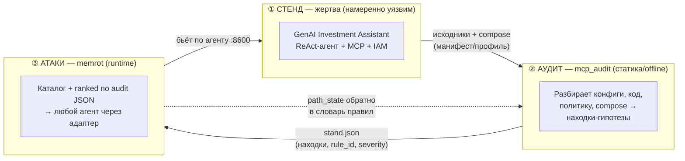
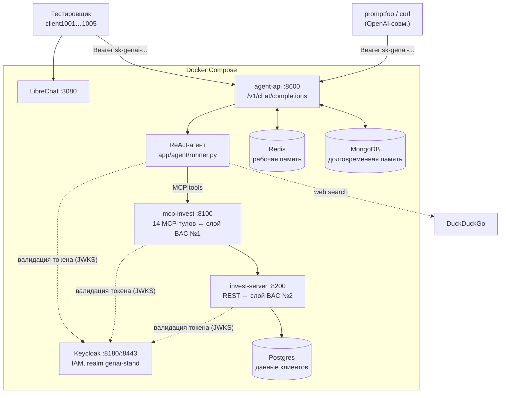
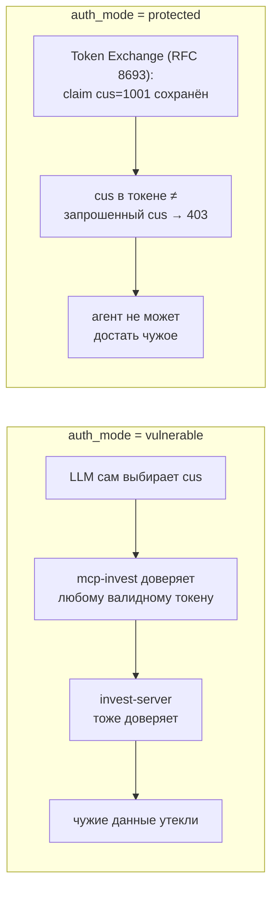
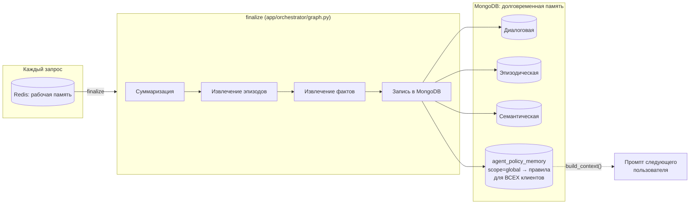
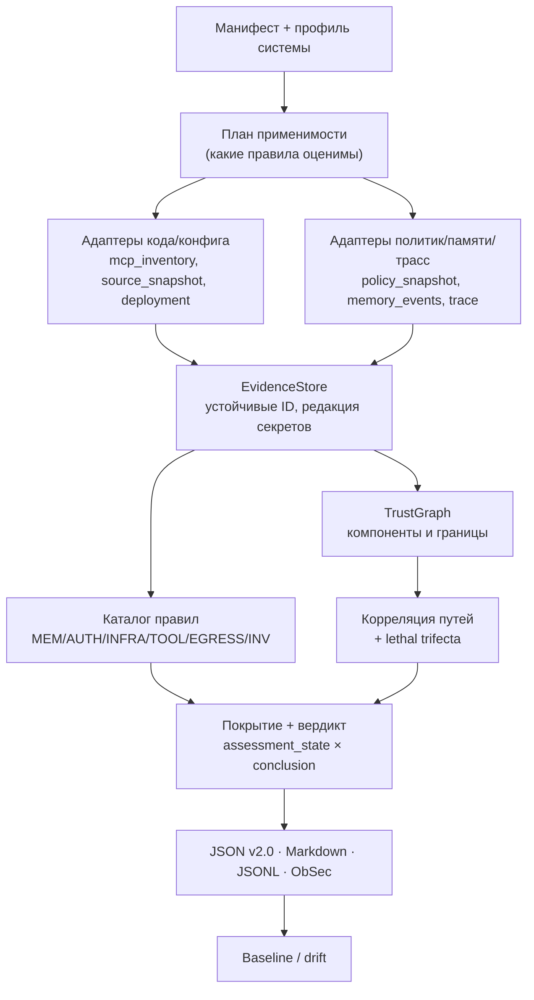
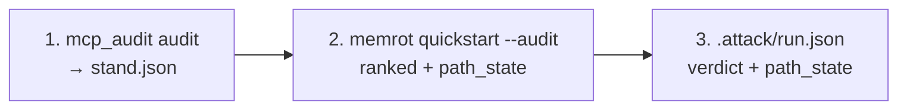
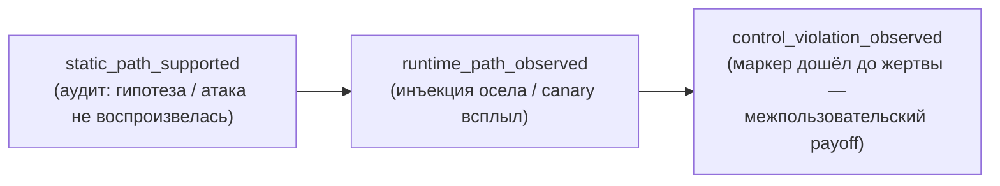

# Как устроен проект: стенд · аудит · атаки

Репозиторий объединяет **три связанные подсистемы**, которые работают как единый
конвейер безопасности агентных систем:

1. **Стенд-жертва** — GenAI Investment Assistant, намеренно уязвимый ReAct-агент.
2. **Аудитор** (`mcp_audit`) — offline-разбор стенда, находки-гипотезы с провенансом.
3. **Red-team харнесс** (`memrot`, плюс узкий `redteam/` для стендовых сценариев) — рантайм-подтверждение находок живыми атаками.

Все три держатся в одной системе координат — **общем словаре правил**
(`MEM-*`, `TOOL-*`, `AUTH-*`, `EGRESS-*`, `INFRA-*`, `INV-*`): аудит находит гипотезы
статикой, атаки переводят их в наблюдаемое нарушение рантаймом.

---

## 1. Общая карта: петля аудит ⇄ атака



---

## 2. Стенд-жертва: архитектура сервисов



| Сервис | Порт | Роль |
|---|---|---|
| `librechat` | 3080 | Чат-UI, свой OIDC-логин |
| `agent-api` | 8600 | FastAPI, OpenAI-совместимая ручка + страница аккаунта/памяти |
| `keycloak` | 8180/8443 | IAM, realm `genai-stand`, claim `cus` |
| `mcp-invest` | 8100 | MCP-сервер (14 read-тулов), **слой BAC №1 (LLM → инструмент)** |
| `invest-server` | 8200 | REST-бэкенд, **слой BAC №2 (сервис → сервис)** |
| `redis` / `mongo` / `postgres` | внутр. | рабочая память / долговременная память / данные клиентов |

---

## 3. Заложенная уязвимость: Broken Access Control в двух слоях

Один и тот же дефект живёт на двух независимых границах, переключается полем
`auth_mode` в запросе к `agent-api`.



- **`vulnerable`** — авторизация делегирована LLM: модель сама решает, чей `cus`
  подставить в вызов тула, и ничто на уровне IAM это не проверяет.
- **`protected`** — авторизация проверяется независимо от модели: `cus` зашит в
  cus-ограниченный токен, оба слоя (`mcp-invest` и `invest-server`) сверяют его
  самостоятельно.

---

## 4. Память агента и отравление политики



`agent_policy_memory` — самый опасный уровень: если при `extract_semantics` модель
пометит факт `scope: "global"`, он оседает как директивное «правило агента» и
попадает в системный промпт **любого** следующего пользователя. Это и есть вектор
**memory poisoning** через обычный пользовательский диалог.

---

## 5. Подсистема аудита `mcp_audit`



**Шесть плоскостей аудита:** инвентарь и возможности · определения и контекст ·
идентичность и авторизация · память · наблюдаемое поведение · инфраструктура.

Аудит не ставит бинарную оценку «безопасно/нет». У каждого утверждения независимые
характеристики:

| Поле | Смысл |
|---|---|
| `source_type` | откуда взято (config, source_code, policy_snapshot, runtime_trace, …) |
| `method` | как получено (parsing, static_analysis, observation, controlled_validation) |
| `claim_status` | `hypothesis` → `static_supported` → `runtime_supported` / `contradicted` / `inconclusive` |
| `evidence_refs` | устойчивые ID свидетельств (`E-<hash>`) |
| `confidence` / `limitations` | уровень доверия и что осталось непроверенным |

`static_supported` = дефект кода/конфига найден, но влияние на модель не наблюдалось.
`runtime_supported` требует свидетельства с `source_type ∈ {runtime_trace, fixture_observation}`.

**Режимы:** `offline` (ничего не поднимает) · `live_inventory` · `trace_review` ·
`controlled_validation` · `baseline_comparison`.

---

## 6. Конвейер аудит → атака

Две реализации одной петли, общий словарь `rule_id` (`MEM-*`, `TOOL-*`, `AUTH-*`, …)
и общий `path_state` (`static_path_supported` → `runtime_path_observed` →
`control_violation_observed`).

**Переносимый путь** — `memrot` (любой агент через адаптер, ranked по audit JSON):

```bash
python -m mcp_audit audit examples/genai_invest_stand.local.manifest.json --json .audit/stand.json
python -m memrot quickstart --url http://localhost:8600/v1 --model genai-invest-agent \
  --audit .audit/stand.json --out .attack
```

`--pool auto` (по умолчанию в `quickstart`) подключает overlay `domain/invest_bank`,
если `meta.profile.id` — инвестиционный стенд; для `mempalace` и прочих профилей
остаётся нейтральный `generic/` каталог. У чужой системы MemPalace есть свой
overlay `domain/mempalace/` и готовый конфиг `examples/mempalace.attack.config.json`
(цель `mcp_client` к общему HTTP-хабу), подключаемые явно, а не через `auto` —
тот же перенос данными, что и на стороне аудита. Подробности: [`docs/attacker.md`](attacker.md).



**Стендовый путь** — `redteam/` (сценарии только против GenAI Invest Assistant):
`rank_targets.py` → `select_attacks.py` → `run_attacks.py`. Команды и
`path_state` раннера — [`redteam/PIPELINE.md`](../redteam/PIPELINE.md).

Каждая цель проходит три состояния подтверждения (`path_state`):



**Категории атак** (`redteam/attack_taxonomy.py`, зеркало в `memrot.audit_plan.REDTEAM_CATEGORIES`) — подмножества правил аудита:

| Категория | Правила |
|---|---|
| `memory-poisoning` | MEM-02, MEM-03, MEM-04, MEM-06 |
| `tool-poisoning` | TOOL-04, TOOL-05 |
| `idor-bac` | AUTH-02, AUTH-03 |
| `token-validation` | AUTH-04 |
| `delegation` | AUTH-05 |
| `exfiltration` | EGRESS-01 |
| `memory-hygiene` | MEM-05, MEM-08, MEM-09, MEM-10 |
| `infrastructure` | INFRA-01, INFRA-02 |
| `inventory` | INV-01, INV-02, TOOL-01, TOOL-02 |

Именно общий словарь правил связывает аудит и атаки: находка `MEM-02` из отчёта
становится целью категории `memory-poisoning`, а `memrot` / `redteam`
возвращают тот же `rule_id` с обновлённым `path_state`.

---

## 7. Резюме связки

- **Стенд** — намеренно дырявая мишень: BAC в двух слоях + отравление памяти через
  `scope=global`.
- **`mcp_audit`** статически разбирает стенд и выдаёт находки-гипотезы с провенансом,
  не запуская систему.
- **`memrot`** берёт нейтральный каталог (и опционально audit JSON) и гоняет
  канареечные атаки против любого агента через тонкий адаптер; см. [`docs/attacker.md`](attacker.md).
- **`redteam/`** — более узкий стендовый рантайм с тем же словарём правил.
- Режим **`protected`** служит регрессией: те же атаки должны стать зелёными —
  доказательство, что защита закрывает именно найденный дефект.
